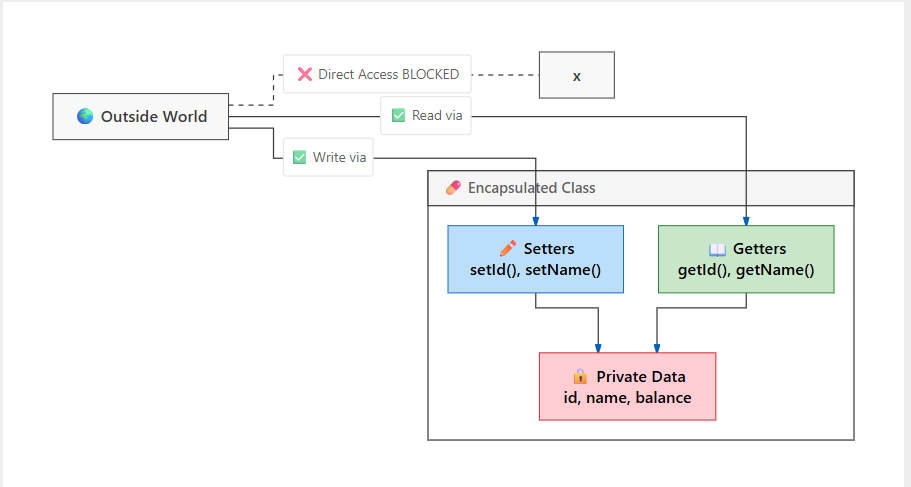
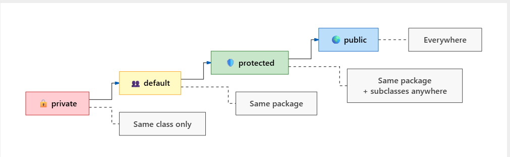
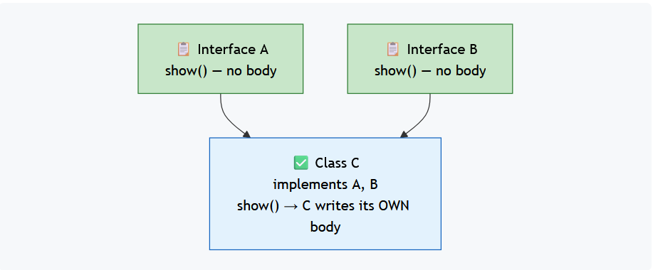

# Part 1: Foundations – Classes, Objects & Memory

  - [🟢 1. What is a Class in Java?](#-1-what-is-a-class-in-java)
  - [🔵 2. What is an Object in Java?](#-2-what-is-an-object-in-java)
  - [🔴 3. How to Create an Object in Java](#-3-how-to-create-an-object-in-java)
  - [🔴 4. JVM-Level Memory Understanding](#-4-jvm-level-memory-understanding)

---
# Part 2: Object Initialization & Core Keywords
  - [🔵 5. Constructor in Java](#-5-constructor-in-java)
  - [🟢 6. Important Points About Constructors](#-6-important-points-about-constructors)
  - [🟠 7. The this Keyword](#-7-the-this-keyword)
  - [🔵 8. Constructor Chaining](#-8-constructor-chaining-in-java--understanding-object-initialization-flow)
  - [🔵 9. The super Keyword](#-9---understanding-super-in-java--a-beginner-friendly-deep-dive)
---
# Part 3: Core OOP Pillar – Encapsulation
  - [🔴 10. Encapsulation in Java](#-10---encapsulation-in-java--data-hiding--controlled-access)
  - [🔵 11. Access Modifiers in Java](#-11---access-modifiers-in-java--controlling-visibility-encapsulation--inheritance)
---
# Part 4: Core OOP Pillar – Inheritance
  - [🔵 12. DRY Principle](#-12---what-is-dry-dont-repeat-yourself)
  - [🟠 13. Inheritance (What, Syntax, Types)](#-13---what-is-inheritance-in-java)
  - [🟢 14. IS-A and HAS-A Relationships](#-14---understanding-is-a-and-has-a-relationships-in-object-oriented-programming)
  - [🔴 15. Association, Aggregation, Composition](#-15---association-in-java--basic-relationship-between-objects)
  - [🔵 16. Composition vs Inheritance](#-16---composition-vs-inheritance--when-to-choose-what-real-design-decision)
  - [🟡 17. Variable Hiding & Method Hiding](#-17---introduction-to-hiding-in-java-variable-hiding--method-hiding)

---
# Part 5: Core OOP Pillar – Polymorphism
  - [🔵 18. Polymorphism (Overloading, Overriding, Upcasting, Downcasting)](#-18---what-is-polymorphism-in-java-core-oop-concept)
  - [🟠 19. Covariant Return Types](#-19---what-is-a-covariant-return-type)
  - [🔴 20. `instanceof` & Pattern Matching](#20---instanceof-in-java--checking-object-type-at-runtime)

---
# Part 6: Core OOP Pillar – Abstraction
  - [🎯 21. Abstraction (Abstract Class, Abstract Method)](#-21---abstraction-in-java--hiding-details-showing-purpose)
  - [🔵 22. Interface (Complete)](#-22---interface-in-java--complete-detailed-explanation-contract-abstraction--flexibility)
  - [🟢 23. Abstract Class vs Interface](#-23---interface-vs-abstract-class-clear-understanding)
  - [🔷 24. `extends` vs `implements` rules](#-24---core-idea--extends-vs-implements)
  - [🔵 25. Marker Interfaces](#-25---marker-interfaces-in-java--signaling-behavior-without-methods)

---
# Part 7: Important Keywords & Special Concepts
  - [🔵 26. Static Keyword](#-26---static-keyword-in-java--understanding-class-level-behavior)
  - [🟠 27. Final Keyword](#-27---final-keyword-in-java--controlling-behavior-in-oop)
  - [🟢 28. Object Class](#-28---object-class-in-java--root-of-all-classes)
  - [🔴 29. Wrapper Classes & Autoboxing](#-29---wrapper-classes-in-java--converting-primitive-types-into-objects)
  - [🟡 30. Enum in Java](#-30---enum-in-java--an-oop-perspective-more-than-just-constants)
  - [🔷 31. Object Cloning](#-31---object-cloning-in-java)
  - [🔴 32. Inner Classes & Anonymous Classes](#-32---inner-classes--anonymous-classes-in-java--deep-oop-understanding)

---
# Part 8: Advanced Design Principles
  - [🔵 33. SOLID Principles](#-33---solid-principles-in-java--real-oop-design-for-experienced-developers-25-years-level)
  - [🔵 34. Immutability](#-34---immutability-in-java--designing-thread-safe-objects-real-interview-concept)

---

## 🟢 1. What is a Class in Java?

A **class** is a **blueprint or template** from which objects are created. It defines **properties** (attributes or fields) and **behaviors** (methods) common to all objects of that type. Classes themselves are not objects—they are more like **plans** or **recipes**.

Imagine a bakery. The **recipe for a cake** is the class: it specifies the ingredients (state) and the steps to bake the cake (behavior). Using this recipe, the bakery can bake multiple cakes, each cake being an **object**. Each cake can have its own flavor, number of layers, or type of icing, but all share the same methods like `bake()` or `decorate()`.

```java
class Cake {
    String flavor;
    String icing;
    int layers;

    void bake() { System.out.println("Baking the cake"); }
    void decorate() { System.out.println("Decorating the cake"); }
}

public class Main {
    public static void main(String[] args) {
        Cake myCake = new Cake();
        myCake.flavor = "Chocolate";
        myCake.icing = "Vanilla";
        myCake.layers = 3;

        System.out.println(myCake.flavor);
        System.out.println(myCake.icing);
        System.out.println(myCake.layers);

        myCake.bake();
        myCake.decorate();
    }
}
```

Here, `Cake` is a class (the blueprint), and `myCake` is an object created from it.

---

## 🔵 2. What is an Object in Java?

In Java, an **object** is a real-world entity or instance of a class. Every object has **state** and **behavior**, where the state is represented by variables (also called fields) and the behavior is represented by methods. Objects are like individual “things” in the real world that have characteristics and actions.

For example, consider a car manufacturing unit. The **blueprint or design** of a car is like a Java class. Using this blueprint, the factory can produce multiple cars. Each car produced is a **distinct object** with its own color, model, and engine type. Though all cars are made from the same blueprint, each car object can have **different values** for these properties.

Every object in Java has two things:

| Aspect | What it means | Stored as |
|---|---|---|
| 🧠 **State** | *What the object knows* — its properties | Variables / Fields |
| 🏃 **Behavior** | *What the object can do* — its actions | Methods |

---

### 🏭 Real-World Analogy — The Car Factory
```
                                    +----------------------------+
                       new Car()   | 🚗 Object 1                |
                     +------------>| Red · Sedan · 2024         |
                     |             +----------------------------+
                     |
+---------------+    | new Car()   +----------------------------+
| 📋 Class      |    |             | 🚙 Object 2                |
| (Blueprint)   |----+------------>| Blue · SUV · 2023          |
+---------------+    |             +----------------------------+
                     |
                     | new Car()   +----------------------------+
                     +------------>| 🚕 Object 3                |
                                   | White · Hatchback · 2025   |
                                   +----------------------------+

```
> A **class** is the blueprint. An **object** is an actual car built from that blueprint.
> Same design → many unique cars, each with its own color, model, and year.

---

### 💻 Code Example

```java
// 📋 The Blueprint (Class)
class Car {
    // 🧠 State — what each car KNOWS
    String color;
    String model;
    int year;

    // 🏃 Behavior — what each car CAN DO
    void start() { System.out.println("Car started 🚀"); }
    void stop()  { System.out.println("Car stopped 🛑"); }
}

public class Main {
    public static void main(String[] args) {

        // 🚗 Creating an Object (a real car from the blueprint)
        Car myCar = new Car();

        // Setting the state
        myCar.color = "Red";
        myCar.model = "Sedan";
        myCar.year  = 2024;

        // Reading the state
        System.out.println(myCar.color);   // Red
        System.out.println(myCar.model);   // Sedan
        System.out.println(myCar.year);    // 2024

        // Calling the behavior
        myCar.start();  // Car started 🚀
        myCar.stop();   // Car stopped 🛑
    }
}
```
> [!NOTE]
> `myCar` is **not** the object itself — it's a **remote control** (reference) that points to the actual object living in memory.
--- 

### 🧩 Breaking It Down Visually

```
    ┌──────────────────────────────────┐
    │         Object: myCar            │
    ├──────────────────────────────────┤
    │  🧠 STATE (Fields)               │
    │  ┌────────┬──────────────────┐   │
    │  │ color  │ "Red"            │   │
    │  │ model  │ "Sedan"          │   │
    │  │ year   │ 2024             │   │
    │  └────────┴──────────────────┘   │
    ├──────────────────────────────────┤
    │  🏃 BEHAVIOR (Methods)           │
    │  • start()  → "Car started 🚀"  │
    │  • stop()   → "Car stopped 🛑"  │
    └──────────────────────────────────┘
```


---

---
## 🔴 3. How to Create an Object in Java

- Objects are created from classes using the `new` keyword, which **allocates memory** in the heap for the object and calls a **constructor** to initialize it. 
- Each object has its own memory space for storing its state, but methods are shared (since they are defined in the class).

### 🔑 The Magic Formula

```
ClassName  variableName  =  new  ClassName();
─────────  ────────────     ───  ───────────
    │           │             │       │
 The type   Reference      Allocates  Calls the
 of object  (remote        memory     constructor
             control)      in Heap    to initialize
```

> [!IMPORTANT]
> The `new` keyword does **two** critical things:
> 1. **Allocates memory** on the Heap for the new object
> 2. **Calls the constructor** to set up the object's initial state

---
## 🔴 4. JVM-Level Memory Understanding

* When we create an object using `new`, **memory is allocated in the Heap**.
* **Stack memory** stores the **reference variable** pointing to the object.
* Each object has its **own copy of instance variables**, while **methods are shared**.

```
  STACK (References)              HEAP (Actual Objects)
 ┌─────────────────┐         ┌─────────────────────────┐
 │ birthdayCake ────┼────────▶│ flavor : "Strawberry"   │
 └─────────────────┘         │ icing  : "Chocolate"    │
                              │ layers : 2              │
                              └─────────────────────────┘

 ┌─────────────────┐         ┌─────────────────────────┐
 │ weddingCake  ────┼────────▶│ flavor : "Vanilla"     │
 └─────────────────┘         │ icing  : "Fondant"      │
                              │ layers : 5              │
                              └─────────────────────────┘
```
> [!NOTE]
> - Each object gets its **own block of memory** on the Heap.
> - The **reference variable** (on the Stack) is just an arrow pointing to that block.
> - **Methods are NOT duplicated** — all objects share the same method code defined in the class.

---
## 🔵 **5. Constructor in Java**

A **constructor** is a **special method** used to initialize objects. It has the same name as the class, **no return type**, and is called automatically when a new object is created.

```java
class Cake {
    String flavor;

    // Constructor
    Cake(String flavor) {
        this.flavor = flavor;
    }

    void printFlavor() {
        System.out.println("Flavor: " + flavor);
    }
}

public class Main {
    public static void main(String[] args) {
        Cake myCake = new Cake("Chocolate"); // constructor called
        myCake.printFlavor();
    }
}
```

* Constructors can be **overloaded**, meaning you can define multiple constructors with **different parameters** to allow different ways of initializing objects.
* You can also use **copy constructors** to create a new object that is a copy of an existing object.
* Within a class, one constructor can call another using `this()`, a process called **constructor chaining**.

---

## 🟢 **6. Important Points About Constructors**

1. Constructors **do not have a return type**, not even `void`.
2. A constructor is called automatically when an object is created.
3. Overloaded constructors allow multiple ways to initialize an object.
4. Copy constructors create a **new object that is identical** to an existing object.
5. `this()` can call another constructor in the same class, avoiding code repetition.

```java
class IceCream {
    String flavor;
    String size;

    IceCream(String flavor) { // default size
        this.flavor = flavor;
        this.size = "Medium";
    }

    IceCream(String flavor, String size) { // overloaded constructor
        this(flavor); // call first constructor
        this.size = size;
    }
}
```

---
## 🟠 **7. The `this` Keyword**

In Java, `this` is a **reference variable** that points to the **current object**. It is useful when:

* You need to differentiate between instance variables and method/constructor parameters with the same name.
* You want to call other methods or return the current object.

**Analogy:** If you are reading a book in a library full of books, you would say “mark the page in **this book**” rather than in some other book. Similarly, `this` refers to **the current object**.

```java
class Cake {
    String flavor;

    Cake(String flavor) {
        this.flavor = flavor; // differentiates instance variable and parameter
    }

    void printFlavor() {
        System.out.println("Flavor: " + this.flavor);
    }
}

public class Main {
    public static void main(String[] args) {
        Cake myCake = new Cake("Vanilla");
        myCake.printFlavor();
    }
}
```

Here, `this.flavor` refers to the **object’s field**, while `flavor` alone refers to the **parameter** passed to the constructor.

---
## 🔵 **8. Constructor Chaining in Java – Understanding Object Initialization Flow**

Constructor chaining is a concept in Java where **one constructor calls another constructor**, either within the same class or from its parent class. This is done to **reuse code, avoid duplication, and ensure proper object initialization**.

When an object is created, Java does not just call one constructor randomly. Instead, it follows a **chain of constructor calls**, starting from the top of the inheritance hierarchy down to the current class. This process ensures that every part of the object is initialized correctly.

Constructor chaining mainly happens using two keywords:

* `this()` → calls another constructor in the same class
* `super()` → calls the constructor of the parent class

---

### 🟣 **8.1 - Using `this()` – Calling Constructor Within Same Class**

The `this()` keyword is used to call another constructor **within the same class**. This is useful when you have multiple constructors and want to reuse initialization logic instead of writing duplicate code.

Let’s understand this with an example:

```java
class Student {
    int id;
    String name;

    // Default constructor
    Student() {
        this(101, "Default"); // calling parameterized constructor
        System.out.println("Default constructor called");
    }

    // Parameterized constructor
    Student(int id, String name) {
        this.id = id;
        this.name = name;
        System.out.println("Parameterized constructor called");
    }
}

public class Main {
    public static void main(String[] args) {
        Student s = new Student();
    }
}
```

When this program runs, the output will be:

```
Parameterized constructor called
Default constructor called
```

Here, the default constructor calls the parameterized constructor using `this()`. This avoids repeating initialization logic and keeps the code clean.

👉 Important rule:
`this()` must always be the **first statement** inside a constructor.

---
### 🟢  8.2 - Using `super()` – Calling Parent Class Constructor

The `super()` keyword is used to call the constructor of the **parent class**. This is important in inheritance because the parent class must be initialized before the child class.

Let’s see an example:

```java
class Person {
    Person() {
        System.out.println("Person constructor called");
    }
}

class Student extends Person {
    Student() {
        super(); // calling parent constructor
        System.out.println("Student constructor called");
    }
}

public class Main {
    public static void main(String[] args) {
        Student s = new Student();
    }
}
```

Output:

```
Person constructor called
Student constructor called
```

Here, when a `Student` object is created, the JVM first calls the `Person` constructor using `super()`, and then executes the `Student` constructor.

👉 Important point:
Even if you don’t write `super()`, Java automatically adds it as the first line.

---

### 🟡 8.3 - Combining `this()` and `super()` – Execution Flow

You cannot use both `this()` and `super()` in the same constructor because **both must be the first statement**. However, they can still work together indirectly through chaining.

Example:

```java
class Person {
    Person() {
        System.out.println("Person constructor");
    }
}

class Student extends Person {

    Student() {
        this(101); // calls another constructor
        System.out.println("Default Student constructor");
    }

    Student(int id) {
        super(); // calls parent constructor
        System.out.println("Parameterized Student constructor: " + id);
    }
}
```

Output:

```
Person constructor
Parameterized Student constructor: 101
Default Student constructor
```

Here’s what happens internally:

1. `Student()` calls `this(101)`
2. `Student(int id)` calls `super()`
3. Parent constructor executes
4. Then child constructors execute in order

This shows how constructor chaining flows across classes.

---

### 🔴 8.4 - Key Rules You Must Remember (Very Important)

Constructor chaining follows strict rules in Java:

* `this()` calls constructor of the same class
* `super()` calls constructor of parent class
* Both must be the **first statement** in constructor
* You cannot use both in the same constructor directly
* If not written, `super()` is added automatically

---

### 🔵 8.5 Real-World Understanding

Think of constructor chaining like **building a house step by step**:

* Parent class → Foundation 🏗️
* Child class → Structure 🏠
* Final object → Complete house

You cannot build walls without laying the foundation first. That’s why `super()` is executed before child constructor logic.

Similarly, `this()` helps reuse internal construction steps within the same class.

---
## 🔵 9 - Understanding `super` in Java – A Beginner-Friendly Deep Dive

In Java, the keyword **`super`** is a **reference variable** that is used to refer to the **immediate parent class object**. It becomes relevant only when **inheritance (IS-A relationship)** is involved. Whenever a class extends another class, Java maintains an internal connection between the child and the parent, and `super` is how the child class talks to its parent.

Think of `super` as saying:
👉 *“I want something from my parent class, not from myself.”*

This is especially important when the child class **overrides** variables, methods, or constructors of the parent class.

```
+------------------+
| 🐾 Parent Class  |
|     Animal       |
+------------------+
          ^
          |
          |  accessed via:
          |  - super.variable
          |  - super.method()
          |  - super()
          |
+------------------+
| 🐶 Child Class   |
|       Dog        |
+------------------+

super = the bridge the child uses to talk to its parent.
```

---

### 🟢 9.1 - Why Do We Need `super`?

When a child class inherits from a parent class, it automatically gets access to its methods and variables. However, problems arise when the **child class defines members with the same name** as the parent. In such cases, Java gives priority to the **child class**. The `super` keyword allows us to explicitly access the **parent version**.

So, `super` is mainly used in three situations:

| Use Case | Syntax | Purpose |
|---|---|---|
| 🔹 Access parent **variable** | `super.variableName` | Resolve variable hiding |
| 🔹 Call parent **method** | `super.methodName()` | Call overridden method |
| 🔹 Invoke parent **constructor** | `super()` or `super(args)` | Initialize parent first |

---

We’ll explore each one in detail with examples and diagrams.

---

### 🟣 9.2 - Using `super` to Access Parent Class Variables

When a child class declares a variable with the **same name** as a variable in the parent class, the parent variable becomes hidden. Java resolves this conflict by letting us use `super.variableName`.

---

### 🧠 **Example: Variable Hiding**

```java
class Animal {
    String color = "White";   // 🐾 parent's color
}

class Dog extends Animal {
    String color = "Black";   // 🐶 child's color (hides parent!)

    void displayColor() {
        System.out.println("Dog color: " + color);         // 🐶 Black
        System.out.println("Animal color: " + super.color); // 🐾 White
    }
}

public class Main {
    public static void main(String[] args) {
        Dog d = new Dog();
        d.displayColor();
    }
}
```

**Output:**
```
Dog color: Black
Animal color: White
```

Here, both `Animal` and `Dog` have a variable named `color`.

* `color` refers to the **child class variable**
* `super.color` refers to the **parent class variable**

---

### 🧩 **Variable Access Flow Diagram**

```
Dog object
   |
   |-- color (Black)  ← accessed by default
   |
   |-- super.color (White) ← explicitly accessed
```

---

### 🟠 9.3 Using `super` to Call Parent Class Methods

When a child class **overrides** a method from the parent class, the child’s version is executed by default. If we want to call the parent’s version as well, we use `super.methodName()`.

---

### 🧠 **Example: Method Overriding**

```java
class Animal {
    void sound() {
        System.out.println("Animal makes a sound 🔊");
    }
}

class Dog extends Animal {
    @Override
    void sound() {
        super.sound();  // 🐾 call parent's version FIRST
        System.out.println("Dog barks 🐕");  // 🐶 then add child behavior
    }
}

public class Main {
    public static void main(String[] args) {
        Dog d = new Dog();
        d.sound();
    }
}
```

**Output:**
```
Animal makes a sound 🔊
Dog barks 🐕
```

In this example, the `Dog` class overrides the `sound()` method.
Using `super.sound()` ensures that the **parent behavior is preserved** before adding child-specific behavior.

---

### 🧩 **Method Call Flow Diagram**

```
Dog.sound()
   |
   |-- super.sound()
   |       |
   |       --> Animal.sound()
   |
   --> Dog-specific sound
```

---

### 🔴 9.4 - Using `super` to Call Parent Class Constructors

One of the **most important uses** of `super` is calling the **parent class constructor**. When an object of a child class is created, Java **always constructs the parent class first**, then the child class.

If we don’t explicitly write `super()`, Java automatically inserts a **no-argument parent constructor**.

---

### 🧠 **Example: Default Constructor**

```java
class Animal {
    Animal() {
        System.out.println("🐾 Animal constructor called");
    }
}

class Dog extends Animal {
    Dog() {
        super();  // ← Java adds this even if you don't write it!
        System.out.println("🐶 Dog constructor called");
    }
}

public class Main {
    public static void main(String[] args) {
        Dog d = new Dog();
    }
}
```

**Output:**
```
🐾 Animal constructor called
🐶 Dog constructor called
```

---

### 🧩 **Constructor Execution Flow**

```
Dog object creation
        |
        |-- Animal constructor
        |
        |-- Dog constructor
```

---

### 🟣 **Parameterized Constructor with `super`**

If the parent class has a **parameterized constructor**, the child **must** call it explicitly.

```java
class Animal {
    Animal(String type) {  // ← No default constructor!
        System.out.println("Animal type: " + type);
    }
}

class Dog extends Animal {
    Dog() {
        super("Mammal");  // ✅ REQUIRED — must match parent's constructor
        System.out.println("Dog constructor");
    }
}
```
**Output:**
```
Animal type: Mammal
Dog constructor
```
### 🧩 Why Does This Fail Without `super("Mammal")`?
```
  ❌ Dog()  →  Java tries to add super()  →  No Animal() exists  →  COMPILE ERROR!

  ✅ Dog()  →  super("Mammal")  →  Animal(String type) found  →  SUCCESS!
```

---

### 🟢 9.5 - Rules and Important Points About `super`

| # | Rule | Why? |
|---|---|---|
| 1️⃣ | `super()` must be the **first statement** in a constructor | Parent must be fully built before child |
| 2️⃣ | `super` **cannot** be used in a `static` context | `super` needs an object; `static` has no object |
| 3️⃣ | `super` refers to the **immediate** parent only | No skipping to grandparent — Java goes one level up |
| 4️⃣ | You **cannot** use both `this()` and `super()` in the same constructor | Both must be the first statement — only one slot! |
| 5️⃣ | If you don't write `super()`, Java adds it **automatically** | Ensures parent is always initialized |

---

### 🔵 9.6 - Real-World Analogy for Better Understanding

Imagine a **Company** and an **Employee**.

* The company has general rules
* The employee follows those rules but may have extra responsibilities

When the employee refers to company policies, that’s like using `super`.

```
Company (Parent)
    ↑
Employee (Child)
```

The employee can say:
👉 “Follow company rule” → `super.rule()`

---

### 🧠 9.7 - `super` vs `this` (Quick Conceptual Contrast)

Even though both are reference variables:

* `this` refers to the **current class object**
* `super` refers to the **parent class object**

They help Java resolve **ambiguity** in inheritance scenarios.

| Feature | `this` | `super` |
|---|---|---|
| **Refers to** | Current class object | Parent class object |
| **Used for variables** | `this.x` → current class `x` | `super.x` → parent class `x` |
| **Used for methods** | `this.method()` → current class method | `super.method()` → parent class method |
| **Used for constructors** | `this()` → another constructor in same class | `super()` → parent class constructor |
| **Must be first statement?** | Yes (in constructor) | Yes (in constructor) |
| **Works in static?** | ❌ No | ❌ No |
| **Analogy** | *"I'll do it myself"* | *"Let me ask my parent"* |


---

### 🟣 9.8 - Complete Flow Diagram of `super` Usage

```
        Parent Class
        -------------
        variables
        methods
        constructors
              ↑
              | super
              |
        Child Class
        ------------
        variables
        methods
        constructors
```
---
# 🔴 10 - Encapsulation in Java – Data Hiding & Controlled Access

Encapsulation is one of the most fundamental concepts in Java and a core pillar of Object-Oriented Programming. It refers to the idea of **wrapping data (variables) and methods (functions) together into a single unit**, which is typically a class. More importantly, encapsulation focuses on **data hiding**, meaning the internal state of an object is not directly accessible from outside the class. Instead, access is controlled through well-defined methods.

In simple terms, encapsulation is like a capsule where the internal details are hidden, and only necessary parts are exposed. This helps in protecting the data from unwanted modification and ensures that it is accessed in a controlled and safe manner.

---

### 🟣 10.1 - How Encapsulation Works – Private Fields & Public Methods

In Java, encapsulation is achieved by declaring class variables as **private** and providing access to them through **public getter and setter methods**. By making variables private, we restrict direct access from outside the class, and by using getters and setters, we control how the data is read and modified.

Let’s understand this with a simple example:

```java
class Student {

    // Private variables (data hiding)
    private int id;
    private String name;

    // Getter method (read access)
    public int getId() {
        return id;
    }

    // Setter method (write access)
    public void setId(int id) {
        this.id = id;
    }

    public String getName() {
        return name;
    }

    public void setName(String name) {
        this.name = name;
    }
}

public class Main {
    public static void main(String[] args) {
        Student s = new Student();

        // Setting values using setters
        s.setId(101);
        s.setName("Sanket");

        // Getting values using getters
        System.out.println(s.getId());
        System.out.println(s.getName());
    }
}
```

### Core Idea:


In this example, the variables `id` and `name` are not directly accessible from outside the class because they are private. Instead, we use `setId()` and `setName()` to assign values, and `getId()` and `getName()` to retrieve them. This ensures that all access to the data is controlled.

---

### 🟢 10.2 - Why Encapsulation is Important – Real Understanding

Encapsulation is important because it provides **control, security, and flexibility** in your code. When you hide the internal data and expose only what is necessary, you reduce the chances of accidental or invalid modifications.

For example, imagine you have a bank account class. You would never want someone to directly change the balance variable. Instead, you would provide methods like `deposit()` and `withdraw()` that validate the operation before updating the balance. This is exactly what encapsulation enables.

Let’s see a slightly improved example:

### ❓ Without Encapsulation — What Could Go Wrong?

Imagine a `BankAccount` class **without** encapsulation:

```java
// ⚠️ BAD DESIGN — No Encapsulation!
class BankAccount {
    double balance;  // 😱 public by default!
}

public class Main {
    public static void main(String[] args) {
        BankAccount acc = new BankAccount();
        acc.balance = 10000;

        // 😱 Anyone can do this:
        acc.balance = -99999;  // Negative balance?! No validation!
        acc.balance = 0;       // Wiped out! No protection!
    }
}
```

> [!CAUTION]
> **Without encapsulation**, anyone can set `balance` to `-99999`. There's no guard, no validation, no safety net. This is catastrophic for a real bank!

---

### ✅ With Encapsulation — Safe & Controlled

```java
class BankAccount {

    // 🔒 Hidden from outside
    private double balance;

    // 💰 Controlled deposit — with validation!
    public void deposit(double amount) {
        if (amount > 0) {
            balance += amount;
            System.out.println("✅ Deposited: ₹" + amount);
        } else {
            System.out.println("❌ Invalid deposit amount!");
        }
    }

    // 💸 Controlled withdrawal — with safety checks!
    public void withdraw(double amount) {
        if (amount > 0 && amount <= balance) {
            balance -= amount;
            System.out.println("✅ Withdrawn: ₹" + amount);
        } else {
            System.out.println("❌ Insufficient balance or invalid amount!");
        }
    }

    // 📖 Read-only access to balance
    public double getBalance() {
        return balance;
    }

    // 🚫 NO setBalance() → balance can ONLY change through deposit/withdraw
}
```

```java
public class Main {
    public static void main(String[] args) {
        BankAccount acc = new BankAccount();

        acc.deposit(5000);       // ✅ Deposited: ₹5000
        acc.withdraw(2000);      // ✅ Withdrawn: ₹2000
        acc.withdraw(9000);      // ❌ Insufficient balance!
        acc.deposit(-500);       // ❌ Invalid deposit amount!

        System.out.println("Balance: ₹" + acc.getBalance());  // 3000.0

        // acc.balance = -99999; // ❌ COMPILE ERROR! (private)
    }
}
```

Here, the `balance` variable is protected. You cannot directly modify it from outside. Instead, all changes go through controlled methods that ensure valid operations. This prevents errors like negative balances or invalid transactions.

Encapsulation also makes your code more maintainable. If you later decide to change how data is stored or validated, you only need to modify the internal implementation of the class without affecting other parts of the program. This improves flexibility and reduces dependencies.

Another key advantage is **data integrity**. Since all updates go through controlled methods, you can enforce rules and constraints, ensuring that the object always remains in a valid state.

---

Encapsulation is not just about using getters and setters—it is about designing your classes in such a way that **data is protected, behavior is controlled, and the internal implementation is hidden from the outside world**. This concept forms the foundation for building secure, maintainable, and scalable Java applications.

---
## 🏗️ 10.3 — The Three Pillars of Encapsulation

```
                                                 +-------------------+
                                                 | 💊 Encapsulation  |
                                                 +-------------------+
                                                           |
                              +----------------------------+-----------------------------+
                              |                            |                             |
                              v                            v                             v
                  +-----------------------+  +---------------------------+  +-------------------------+
                  | 🔒 Data Hiding       |  | 🚪 Controlled Access      |  | 🛡️ Data Integrity       |
                  | Make fields private   |  | Provide getters & setters |  | Validate inside methods |
                  +-----------------------+  +---------------------------+  +-------------------------+
```

| Pillar | What It Means | How You Do It |
|---|---|---|
| 🔒 **Data Hiding** | Internal state is invisible to outside | Declare variables as `private` |
| 🚪 **Controlled Access** | Data is read/written only through methods | Create `public` getters & setters |
| 🛡️ **Data Integrity** | Invalid data is rejected at the gate | Add `if` checks inside setters |

---


# 🔵 11 - Access Modifiers in Java – Controlling Visibility (Encapsulation + Inheritance)

Access modifiers in Java define **where a class, method, or variable can be accessed from**. They are extremely important because they help enforce **encapsulation (data hiding)** and also control how members behave in **inheritance**.

In simple terms, access modifiers decide **who can see and use your code**. By using the right modifier, you can protect your data, expose only what is necessary, and design your classes in a clean and secure way.

Java provides four types of access modifiers:

* `private`
* `default` (no keyword)
* `protected`
* `public`

Each of these has a different level of visibility.

### 🏢 The Building Analogy — Used Throughout This Guide

Think of your Java project as a **building with floors and rooms**. Each access modifier is like a **different type of key card**:

```
   ┌─────────────────────────────────────────────────┐
   │                🌍 PUBLIC                         │
   │  Open to everyone — lobby, reception             │
   │  ┌─────────────────────────────────────────┐     │
   │  │          🛡️ PROTECTED                    │     │
   │  │  Floor access — employees + family        │     │
   │  │  ┌─────────────────────────────────┐     │     │
   │  │  │        👥 DEFAULT                │     │     │
   │  │  │  Department-only access          │     │     │
   │  │  │  ┌─────────────────────────┐     │     │     │
   │  │  │  │     🔒 PRIVATE           │     │     │     │
   │  │  │  │  Personal locker         │     │     │     │
   │  │  │  │  Only YOU can open it    │     │     │     │
   │  │  │  └─────────────────────────┘     │     │     │
   │  │  └─────────────────────────────────┘     │     │
   │  └─────────────────────────────────────────┘     │
   └─────────────────────────────────────────────────┘
```

### 🧩 Java's Four Access Modifiers at a Glance


---

### 🟣 11.1 - `private` – Accessible Only Within Same Class

The `private` modifier is the **most restrictive**. A private member can only be seen and used **inside the class that declares it**. Nothing outside — not even a child class that extends it — can touch it directly.

This is the **backbone of encapsulation**. You make your variables `private` to protect them, and then provide `public` getter/setter methods as controlled doors.

This is mainly used for **data hiding**, which is a core part of encapsulation.

### 🏢 Analogy

> `private` = Your **personal locker** at the office. Only *you* have the key. Not your teammates, not your boss, not even your family members who work in the same building.

```java
class Person {
    private int age;  // 🔒 Only Person class can see this

    // 🚪 Controlled door — public setter
    public void setAge(int age) {
        if (age >= 0 && age <= 150) {
            this.age = age;
        }
    }

    // 🚪 Controlled door — public getter
    public int getAge() {
        return age;
    }
}

public class Main {
    public static void main(String[] args) {
        Person p = new Person();

        // ❌ p.age = 25;        → COMPILE ERROR! (private)
        // ❌ Can't touch it directly

        p.setAge(25);            // ✅ Goes through the controlled door
        System.out.println(p.getAge());  // ✅ 25
    }
}
```

Here, `age` is private, so it cannot be accessed directly. We use getter and setter methods to control access. Even if another class extends `Person`, it still cannot access `age` directly.

👉 In inheritance:

* Not accessible in subclass ❌
* Only accessible through methods ✔️

### 🧬 How Does `private` Behave in Inheritance?

```java
class Person {
    private int age = 30;  // 🔒 private
}

class Student extends Person {
    void display() {
        // System.out.println(age);  ❌ COMPILE ERROR!
        // Even though Student "extends" Person, it CANNOT see age.
        // It must use getAge() if Person provides one.
    }
}
```
> [!IMPORTANT]
> **Private members are NOT inherited.** The child class doesn't even know they exist. The only way to interact with them is through `public` or `protected` methods that the parent provides.

### 📋 Visibility Summary

| Context | Accessible? |
|---|---|
| Same class | ✅ Yes |
| Same package, different class | ❌ No |
| Same package, subclass | ❌ No |
| Different package, subclass | ❌ No |
| Different package, non-subclass | ❌ No |

---

---

### 🟢 11.2 - `default` – Accessible Within Same Package

If you don’t specify any modifier, Java uses the **default access modifier** (also called package-private). Members with default access can be accessed **only within the same package**.
If another class is in the same package, it can access this method. But if it is in a different package, it cannot.

### 💻 Code Example

```java
// 📁 File: Animal.java (package: animals)
package animals;

class Animal {
    void sound() {   // 👥 No modifier = default access
        System.out.println("Animal makes a sound");
    }
}
```

```java
// 📁 File: Dog.java (package: animals) — SAME package
package animals;

class Dog {
    void test() {
        Animal a = new Animal();
        a.sound();   // ✅ Works! Same package.
    }
}
```

```java
// 📁 File: Main.java (package: app) — DIFFERENT package
package app;

import animals.Animal;

class Main {
    void test() {
        Animal a = new Animal();
        // a.sound();  ❌ COMPILE ERROR! Different package.
    }
}
```

### 🧬 How Does `default` Behave in Inheritance?
👉 In inheritance:

* Same package subclass → accessible ✔️
* Different package subclass → not accessible ❌

```java
// 📁 Same package → subclass CAN access
package animals;
class Cat extends Animal {
    void test() {
        sound();  // ✅ Inherited and accessible (same package)
    }
}
```

```java
// 📁 Different package → subclass CANNOT access
package pets;
import animals.Animal;
class PetCat extends Animal {
    void test() {
        // sound();  ❌ COMPILE ERROR! Different package.
    }
}
```

> [!NOTE]
> Default access is **package-dependent**, not inheritance-dependent. Even if `PetCat` is a subclass of `Animal`, it can't access default members across packages.

### 📋 Visibility Summary

| Context | Accessible? |
|---|---|
| Same class | ✅ Yes |
| Same package, different class | ✅ Yes |
| Same package, subclass | ✅ Yes |
| Different package, subclass | ❌ No |
| Different package, non-subclass | ❌ No |

---

---

### 🟡 11.3 - `protected` – Accessible in Same Package + Subclasses**

The `protected` modifier opens the door a little wider than `default`. It allows access in two situations:

1. **Any class** in the **same package** (just like `default`)
2. **Subclasses** even if they are in a **different package** (this is the extra power!)

This makes `protected` the **go-to modifier for inheritance-friendly members** — things you want to share with your children but not with the entire world.

### 🏢 Analogy

> `protected` = The **family recipe book** 📖. Everyone in your household (same package) can read it. Your children who moved to another city (subclass in different package) can still access it because they're family. But your neighbor (non-subclass in different package)? No access.

---
### 💻 Code Example

```java
// 📁 File: Animal.java (package: animals)
package animals;

public class Animal {
    protected void sound() {   // 🛡️ protected
        System.out.println("Animal makes a sound");
    }
}
```

```java
// 📁 File: Dog.java (package: pets) — DIFFERENT package, but subclass!
package pets;

import animals.Animal;

class Dog extends Animal {
    void display() {
        sound();  // ✅ Works! Dog is a subclass of Animal.
    }
}
```

```java
// 📁 File: Trainer.java (package: pets) — DIFFERENT package, NOT a subclass!
package pets;

import animals.Animal;

class Trainer {
    void test() {
        Animal a = new Animal();
        // a.sound();  ❌ COMPILE ERROR! Trainer is NOT a subclass.
    }
}
```

### 🧬 The Key Insight

```
     📁 Package: animals               📁 Package: pets
   ┌─────────────────────┐          ┌─────────────────────┐
   │  Animal              │          │  Dog extends Animal  │
   │  🛡️ protected sound()│          │  sound() → ✅        │
   │                      │          │                      │
   │  Zookeeper           │          │  Trainer             │
   │  sound() → ✅        │          │  sound() → ❌        │
   │  (same package)      │          │  (not a subclass)    │
   └─────────────────────┘          └─────────────────────┘
```

> [!TIP]
> **When to use `protected`?** When you're designing a class that's meant to be extended, and you want subclasses to have access to certain internal details — but you still want to keep those details hidden from the general public.

### 📋 Visibility Summary

| Context | Accessible? |
|---|---|
| Same class | ✅ Yes |
| Same package, different class | ✅ Yes |
| Same package, subclass | ✅ Yes |
| Different package, subclass | ✅ Yes |
| Different package, non-subclass | ❌ No |

---


👉 In inheritance:

* Same package → accessible ✔️
* Different package subclass → accessible ✔️
* Non-subclass (different package) → not accessible ❌

---

### 🔴 11.4 - `public` – Accessible Everywhere

The `public` modifier is the **most open** — zero restrictions. A public member can be accessed from **anywhere in the entire program**, no matter which package or class is trying to use it.

This is used for things you **intentionally want to expose** to the outside world — like your API methods, main classes, and utility functions.

### 🏢 Analogy

> `public` = The **company's reception desk** 🌍. Anyone can walk in — employees, visitors, delivery agents, even random strangers. It's designed to be fully accessible.

```java
class Animal {
    public void sound() {
        System.out.println("Animal sound");
    }
}

public class Main {
    public static void main(String[] args) {
        Animal a = new Animal();
        a.sound(); // accessible everywhere
    }
}
```

👉 In inheritance:

* Accessible everywhere ✔️

### 📋 Visibility Summary

| Context | Accessible? |
|---|---|
| Same class | ✅ Yes |
| Same package, different class | ✅ Yes |
| Same package, subclass | ✅ Yes |
| Different package, subclass | ✅ Yes |
| Different package, non-subclass | ✅ Yes |

---

### 🔵 11.5 - Access Modifiers with Inheritance – Clear Understanding

Now let's put all four modifiers in **one parent class** and see exactly what a child class can and cannot access:

### 💻 Combined Code Example

```java
class Parent {
    private   int a = 10;   // 🔒 private
              int b = 20;   // 👥 default (no modifier)
    protected int c = 30;   // 🛡️ protected
    public    int d = 40;   // 🌍 public
}

class Child extends Parent {
    void display() {
        // System.out.println(a);  ❌ private — invisible to child
        System.out.println(b);     // ⚠️ depends on package (same = ✅, different = ❌)
        System.out.println(c);     // ✅ protected — always visible to subclass
        System.out.println(d);     // ✅ public — always visible to everyone
    }
}
```

### 🧩 What the Child Sees

```
   Parent Object (inside Child)
   ┌──────────────────────────────────────────────┐
   │  🔒 private   a = 10   →  ❌ INVISIBLE       │
   │  👥 default   b = 20   →  ⚠️ Same pkg only   │
   │  🛡️ protected c = 30   →  ✅ VISIBLE          │
   │  🌍 public    d = 40   →  ✅ VISIBLE          │
   └──────────────────────────────────────────────┘
```

> [!NOTE]
> The `private` member `a` still **exists** inside the object (memory is allocated for it), but the child class simply **cannot see or use it**. It's like a locked room inside your inherited house — the room is there, but you don't have the key.

---

Here’s what happens:

* `private` → not inherited directly
* `default` → only works if same package
* `protected` → works in subclass
* `public` → always accessible

---

### 🟣 11.6 - Real-World Understanding

Think of access modifiers like **security levels in an organization**:

* `private` → Personal locker 🔒
* `default` → Team access 👥
* `protected` → Team + special members (subclasses) 🛡️
* `public` → Open to everyone 🌍

Each level controls how much access others have.

---

### 🟢 11.7 - Why Access Modifiers Are Important

Access modifiers are crucial because they help you:

* Protect sensitive data (Encapsulation)
* Control visibility of methods and variables
* Design clean APIs
* Prevent misuse of code
* Support inheritance safely

In real-world applications, especially large systems, proper use of access modifiers ensures that your code is **secure, maintainable, and scalable**.

---
# 🔵 12 - What is DRY (Don't Repeat Yourself)?

The **DRY principle** is a fundamental software engineering guideline that says:

> *“Every piece of knowledge or logic must have a single, unambiguous, authoritative representation in the system.”*

In simpler terms, **don’t write the same code more than once**. Instead, **reuse it** through methods, classes, inheritance, or other mechanisms.

In simple terms: **write your code once, and reuse it** through methods, classes, inheritance, or constants. If you ever need to fix or update that logic, you only change it in **one single place** — and every usage is automatically updated.

**Why?**

* Reduces **bugs**: if you need to fix something, you fix it in **one place** instead of multiple places.
* Makes code **easier to maintain**.
* Improves **readability and organization**.
* Reduces **redundancy**, saving time and memory.

---

### 🍰 The Recipe Book Analogy
Imagine a bakery: instead of writing the chocolate cake recipe 5 times in your recipe book, you write it **once** and refer to it whenever needed. If you change the recipe later, you only update it once.
```
  ❌ WITHOUT DRY (The Messy Way)
  ┌─────────────────────────────────────┐
  │ 📖 Recipe Book                      │
  │                                     │
  │ Page 1: Chocolate Cake Recipe 🍫    │
  │ Page 5: Chocolate Cake Recipe 🍫    │  ← Same recipe
  │ Page 9: Chocolate Cake Recipe 🍫    │  ← copied 5 times!
  │ Page 14: Chocolate Cake Recipe 🍫   │
  │ Page 20: Chocolate Cake Recipe 🍫   │
  │                                     │
  │ 😱 You change the sugar amount?     │
  │ → Must update ALL 5 pages!          │
  │ → Miss one? → Inconsistent cakes!   │
  └─────────────────────────────────────┘

  ✅ WITH DRY (The Smart Way)
  ┌─────────────────────────────────────┐
  │ 📖 Recipe Book                      │
  │                                     │
  │ Page 1: Chocolate Cake Recipe 🍫    │  ← Written ONCE
  │                                     │
  │ Page 5:  "See page 1" 👉           │
  │ Page 9:  "See page 1" 👉           │  ← All refer
  │ Page 14: "See page 1" 👉           │     to ONE place
  │ Page 20: "See page 1" 👉           │
  │                                     │
  │ 😊 Change the sugar amount?         │
  │ → Update page 1 ONLY!              │
  │ → All references auto-updated! ✅   │
  └─────────────────────────────────────┘
```

> **That's DRY** — one source of truth, referenced everywhere.

---

## 🟢 12.1 - How DRY Applies in Java

Java, being **object-oriented**, has several features that naturally help you follow DRY:

### Methods

Instead of writing the same logic multiple times, put it in a **method** and call it whenever needed.

```java
class Calculator {
    int add(int a, int b) {
        return a + b; // logic written only once
    }
}

public class Main {
    public static void main(String[] args) {
        Calculator calc = new Calculator();
        System.out.println(calc.add(5, 3)); // reuse method
        System.out.println(calc.add(10, 20)); // reuse again
    }
}
```

---

### Constructors & Constructor Chaining

Instead of repeating initialization code in multiple constructors, use **constructor chaining** with `this()`.

```java
class IceCream {
    String flavor;
    String size;

    IceCream(String flavor) {
        this.flavor = flavor;
        this.size = "Medium";
    }

    IceCream(String flavor, String size) {
        this(flavor); // reuses code from the first constructor
        this.size = size;
    }
}
```

Here, we **avoid repeating `this.flavor = flavor;`**, following DRY.

---

### Inheritance

If multiple classes share behavior, we put that behavior in a **parent class** instead of repeating it in each child class.

```java
class Vehicle {
    void start() { System.out.println("Vehicle started"); }
}

class Car extends Vehicle {}
class Bike extends Vehicle {}

public class Main {
    public static void main(String[] args) {
        Car c = new Car();
        Bike b = new Bike();
        c.start(); // reused method from Vehicle
        b.start(); // reused method from Vehicle
    }
}
```

The `start()` method is **written only once** in `Vehicle` and reused in `Car` and `Bike`.

---

### Constants and Static Fields

Instead of repeating a value multiple times, define it as a **constant** using `static final`.

```java
class MathConstants {
    static final double PI = 3.14159; // defined once
}

public class Main {
    public static void main(String[] args) {
        double area = MathConstants.PI * 5 * 5; // reuse
        double circumference = 2 * MathConstants.PI * 5; // reuse
    }
}
```

If you ever need to change PI, you update it in **one place**.

---

## 🔴 12.2 - Benefits of DRY in Java

1. **Maintainability**: Easier to update logic in one place.
2. **Readability**: Cleaner code with less repetition.
3. **Reduced bugs**: Fixing one method updates all usages.
4. **Reusability**: Encourages modular, reusable code.

---

**In short:**
DRY is about **writing code once and reusing it**. Java’s features like **methods, constructors, inheritance, static fields, and classes** help us implement DRY effectively.
Alright, let’s go **all-in on inheritance in Java**. I’ll explain **what inheritance is**, **all inheritance types**, **how Java actually supports them**, and then go through **dos and don’ts**, with **examples, diagrams, JVM intuition, and real-world analogies**—all in clear paragraphs, beginner-friendly.

---


# 🔵 13 - What is Inheritance in Java?

[!TIP]
> **One-liner:** Inheritance lets a child class **borrow** everything from a parent class, so you don't have to write the same code twice.

Inheritance is one of the **four pillars of OOP**. It's a mechanism where one class (the **child** or **subclass**) can **reuse and extend** the properties and behaviors of another class (the **parent** or **superclass**).

The keyword used is **`extends`** — the child class *extends* the parent class.

When a child class inherits from a parent:
- It **automatically gets** all non-private fields and methods of the parent
- It can **add** new fields and methods of its own
- It can **override** (replace) parent methods with its own version

This promotes three key benefits:

| Benefit | What It Means |
|---|---|
| ♻️ **Code Reusability** | Write once in the parent, reuse in all children |
| 🔧 **Maintainability** | Fix a bug in the parent → all children are fixed |
| 🏗️ **Logical Hierarchy** | Mirrors real-world relationships (Dog → Animal → Living Thing) |

### 👨‍👩‍👧‍👦 The Family Analogy

Think of inheritance like a **family tree**:

```
  👴 Grandfather (Grandparent Class)
       │
       │  Traits: family name, eye color, traditions
       │
  👨 Father (Parent Class)
       │
       │  Inherited: family name, eye color, traditions
       │  Added: profession, hobbies
       │
  👦 Son (Child Class)
       │
       │  Inherited: family name, eye color, traditions, profession basics
       │  Added: own interests, own skills
       │  Overridden: maybe a different hobby than dad!
```

> A child **inherits traits** from parents. They may add new traits or change some behaviors, but the **foundation** comes from the parent.

---

---

## 🟢 13.1 -  Basic Syntax of Inheritance

```java
class Parent {
    void show() {
        System.out.println("Parent class method");
    }
}

class Child extends Parent {
    void display() {
        System.out.println("Child class method");
    }
}

public class Main {
    public static void main(String[] args) {
        Child c = new Child();
        c.show();      // ✅ Inherited from Parent!
        c.display();   // ✅ Child's own method
    }
}
```

**Output:**
```
Parent class method
Child class method
```
Here, `Child` inherits the `show()` method from `Parent`. The child can call `show()` as if it were its own method, demonstrating inheritance. The child can also have its own method `display()`, which is separate from the parent.  

```
┌─────────────────────────────┐
│       👨 Parent Class       │
│     • show()                │
└──────────────┬──────────────┘
               │ extends
               │
               ▼
┌─────────────────────────────┐
│       👦 Child Class        │
│     • display()             │
│     • show() ← inherited    │
└─────────────────────────────┘
```

### 📐 The Syntax Formula

```
  class ChildClass  extends  ParentClass {
  ─────────────     ───────  ───────────
       │               │         │
   New class       Keyword    Existing class
   (inherits)     (connects)  (provides code)
  }
```

---

## 🔴 13.2 - Types of Inheritance in Java- 

Java conceptually supports **five types of inheritance**, but **only some are allowed using classes**. Let’s go through each clearly.

---

## 🔵 **Single Inheritance**

**Definition:**
A child class inherits from **one parent class**.

```
Parent
  ↓
Child
```

**Example:**

```java
class Animal {
    void eat() {
        System.out.println("Eating... 🍖");
    }
}

class Dog extends Animal {
    void bark() {
        System.out.println("Barking... 🐕");
    }
}

public class Main {
    public static void main(String[] args) {
        Dog d = new Dog();
        d.eat();   // ✅ Inherited from Animal
        d.bark();  // ✅ Dog's own method
    }
}
```

**Output:**
```
Eating... 🍖
Barking... 🐕
```

```
┌──────────────────────┐
│    🐾 Animal         │
│    eat()             │
└──────────┬───────────┘
           │
           ▼
┌──────────────────────┐
│     🐶 Dog           │
│     bark()           │
└──────────────────────┘
```

This is the **simplest and most commonly used** form of inheritance.

✔ Supported in Java
✔ Easy to understand
✔ No ambiguity

---

## 🟢 Multilevel Inheritance

**Definition:**
A class inherits from a parent, which itself inherits from another class.

```
Grandparent
     ↓
  Parent
     ↓
   Child
```

```
┌──────────────────────┐
│    🐾 Animal         │
│    eat()             │
└──────────┬───────────┘
           │
           ▼
┌──────────────────────┐
│    🦁 Mammal         │
│    walk()            │
└──────────┬───────────┘
           │
           ▼
┌──────────────────────┐
│     🐶 Dog           │
│     bark()           │
└──────────────────────┘
```

**Example:**

```java
class Animal {
    void eat() {
        System.out.println("Eating... 🍖");
    }
}

class Mammal extends Animal {
    void walk() {
        System.out.println("Walking... 🚶");
    }
}

class Dog extends Mammal {
    void bark() {
        System.out.println("Barking... 🐕");
    }
}

public class Main {
    public static void main(String[] args) {
        Dog d = new Dog();
        d.eat();   // ✅ From Animal (grandparent)
        d.walk();  // ✅ From Mammal (parent)
        d.bark();  // ✅ Dog's own
    }
}
```

**Output:**
```
Eating... 🍖
Walking... 🚶
Barking... 🐕
```

Here, `Dog` inherits from both `Mammal` and `Animal`.

✔ Supported in Java
✔ Promotes hierarchical design
✔ Common in real-world modeling

---

## 🟠 Hierarchical Inheritance

**Definition:**
Multiple child classes inherit from **the same parent class**.

```
        Parent
       /      \
   Child1   Child2
```


**Example:**

```java
class Animal {
    void eat() {
        System.out.println("Eating...");
    }
}

class Dog extends Animal {
    void bark() {
        System.out.println("Barking...");
    }
}

class Cat extends Animal {
    void meow() {
        System.out.println("Meowing...");
    }
}
```

Both `Dog` and `Cat` reuse `Animal` behavior.

✔ Supported in Java
✔ Very common
✔ Encourages reuse

---

## 🔴 Multiple Inheritance (NOT supported using classes)

**A single child class inheriting from two or more parent classes.**
 
```
  Parent1   Parent2
       \   /
       Child
```
 
Java **does not support** multiple inheritance with classes. Here's why:
 
> ⚠️ **The Diamond Problem:** If both `Parent1` and `Parent2` define a method with the same name, the child class wouldn't know which version to use. This ambiguity can cause unpredictable behavior.

```java
// ❌ This is NOT valid Java
class Child extends Parent1, Parent2 { }
```

### ❌ Why Java does NOT support this with classes

```java
class A {
    void show() { System.out.println("A"); }
}

class B {
    void show() { System.out.println("B"); }
}

// NOT ALLOWED
class C extends A, B { }
```

In this case, if `C` tries to call `show()`, it won't know whether to use `A`'s version or `B`'s version. This is the **diamond problem**. To avoid this, Java simply disallows multiple inheritance with classes. 

---

## 🔵 Hybrid Inheritance

**Definition:**
Combination of multiple inheritance types.

```
       A
      / \
     B   C
      \ /
       D
```

❌ Not supported with classes
✔ Supported using interfaces

---

## 🟣 Multiple Inheritance using Interfaces (SUPPORTED)

Java solves the problem elegantly using **interfaces**. Since interfaces only define **what** to do (not **how**), the child class is forced to provide its own implementation — eliminating ambiguity.

```java
interface A {
    void show();  // 📋 Contract only — no body
}

interface B {
    void show();  // 📋 Contract only — no body
}

class C implements A, B {
    // ✅ C MUST provide its own implementation — no ambiguity!
    public void show() {
        System.out.println("C's own implementation — no confusion! ✅");
    }
}
```


✔ Supported using interfaces
✔ No ambiguity
✔ JVM forces implementation

---

## 🧠 13.3 - JVM-Level Understanding of Inheritance
When you create a child object, the JVM doesn't just store the child's fields. It actually builds the **entire inheritance chain** inside a single object — parent data is embedded inside the child.

### 💻 For Multilevel Inheritance: `Dog extends Mammal extends Animal`

```
   HEAP MEMORY
   ┌──────────────────────────────────┐
   │        Dog Object                │
   │  ┌──────────────────────────┐   │
   │  │  🐾 Animal layer          │   │
   │  │  • eat()                  │   │
   │  │  • (Animal's fields)      │   │
   │  ├──────────────────────────┤   │
   │  │  🦁 Mammal layer          │   │
   │  │  • walk()                 │   │
   │  │  • (Mammal's fields)      │   │
   │  ├──────────────────────────┤   │
   │  │  🐶 Dog layer             │   │
   │  │  • bark()                 │   │
   │  │  • (Dog's fields)         │   │
   │  └──────────────────────────┘   │
   └──────────────────────────────────┘
```

> [!NOTE]
> Even though `Dog` is one object, it internally contains data from **every class in its inheritance chain**. That's why `Dog` can call `eat()` (from `Animal`) and `walk()` (from `Mammal`) — those methods and fields physically exist inside the `Dog` object.

---


# 🔵 14 - Understanding IS-A and HAS-A Relationships in Object-Oriented Programming

When we design software using **Object-Oriented Programming (OOP)**, we try to model real-world entities using **classes** and **objects**. Just like in the real world, objects can be related to each other in different ways. Two of the most important and commonly used relationships are **IS-A** and **HAS-A**. These relationships help us write clean, reusable, and logically structured code that is easy to understand and maintain, especially for beginners.

---

## 🟢 14.1 - What is an IS-A Relationship? (Inheritance)**

An **IS-A relationship** represents **inheritance**, which means one class is a specialized version of another class. In simple terms, if we can say **“A is a B”**, then it is an IS-A relationship.

For example:
- A **Dog is an Animal**
- A **Car is a Vehicle**
- A **Student is a Person**

This relationship allows a child class to **inherit properties and behaviors** from a parent class. The main advantage here is **code reusability**. Instead of writing the same code again, the child class automatically gets it from the parent class.

In programming, IS-A relationships are implemented using the `extends` keyword (in Java), or similar mechanisms in other languages.

---

### 🟣 **IS-A Relationship Code Example (Java)**

```java
// Parent class
class Animal {
    void eat() {
        System.out.println("This animal eats food");
    }
}

// Child class
class Dog extends Animal {
    void bark() {
        System.out.println("The dog barks");
    }
}

public class Main {
    public static void main(String[] args) {
        Dog dog = new Dog();
        dog.eat();   // Inherited method
        dog.bark();  // Dog's own method
    }
}
```

Here, **Dog IS-A Animal**. The `Dog` class automatically gets the `eat()` method from the `Animal` class. This means the dog can eat **without us rewriting the code**, which is the essence of inheritance.

---

### 🧩 **IS-A Relationship Diagram**

```
        Animal
           |
           |  IS-A
           ↓
          Dog
```

This diagram shows that `Dog` is a specialized form of `Animal`. Any behavior common to all animals can be placed in the `Animal` class and reused by all its child classes.

---

## 🟠 14.2 - What is a HAS-A Relationship? (Composition / Aggregation)

A **HAS-A relationship** means one class **contains** another class as a part of it. If we can say **“A has a B”**, then it is a HAS-A relationship.

Examples:
- A **Car has an Engine**
- A **Person has a Heart**
- A **Library has Books**

This relationship is about **using objects**, not inheriting them. HAS-A relationships improve **flexibility** because we can change the internal components without affecting the main class structure.

HAS-A is implemented by **creating an object of one class inside another class**.

---

### 🟡 HAS-A Relationship Code Example (Java)

```java
// Engine class
class Engine {
    void start() {
        System.out.println("Engine starts");
    }
}

// Car class
class Car {
    Engine engine = new Engine();

    void drive() {
        engine.start();
        System.out.println("Car is moving");
    }
}

public class Main {
    public static void main(String[] args) {
        Car car = new Car();
        car.drive();
    }
}
```

In this example, **Car HAS-A Engine**. The `Car` class does not inherit from `Engine`. Instead, it **uses** the `Engine` object to perform its function.

---

### 🧩 **HAS-A Relationship Diagram

```
     Car
      |
      |  HAS-A
      ↓
    Engine
```

This shows that the `Engine` is a **part** of the `Car`, but it is not a type of `Car`. This distinction is very important in OOP design.

---

## 🔴 14.3 - Key Differences Through Real-World Thinking

To understand when to use IS-A or HAS-A, imagine the sentence you are forming:

If the sentence sounds **natural and logical**, then the relationship is probably correct.

- ✔ “A Dog is an Animal” → IS-A  
- ❌ “A Dog is an Engine” → Incorrect  
- ✔ “A Car has an Engine” → HAS-A  
- ❌ “A Car is an Engine” → Incorrect  

This thinking helps avoid common design mistakes made by beginners.

---

## 🔵 14.4 - Combining IS-A and HAS-A Together

In real applications, we often use **both relationships together** to model complex systems.

---

### 🟣 **Combined Example**

```java
class Engine {
    void start() {
        System.out.println("Engine started");
    }
}

class Vehicle {
    void move() {
        System.out.println("Vehicle moves");
    }
}

class Car extends Vehicle {
    Engine engine = new Engine();

    void drive() {
        engine.start();
        move();
        System.out.println("Car is driving");
    }
}
```

Here:
- **Car IS-A Vehicle**
- **Car HAS-A Engine**

---

### 🧠 Combined Relationship Diagram

```
          Vehicle
             |
             | IS-A
             ↓
            Car
             |
             | HAS-A
             ↓
           Engine
```

This structure is very common in real-world software like **banking systems, games, e-commerce apps, and operating systems**.

## 🟢 14.5 - Why IS-A and HAS-A Relationships Matter

Using the correct relationship makes your code:
- Easier to read and understand
- More reusable
- Flexible to change
- Closer to real-world thinking
  
---
# 🔵 15 - Association in Java – Basic Relationship Between Objects

Association is one of the simplest forms of relationship in Object-Oriented Programming. It represents a **"uses-a" or "has-a" relationship** between two classes. In this relationship, one object is connected to another object, but both objects can **exist independently** of each other.

In simple terms, association means that two classes are related in some way, but neither class depends on the other for its lifecycle. For example, a **Teacher and Student** relationship is an association. A teacher can exist without a student, and a student can exist without a teacher.

Let’s understand this with a simple example:

```java
class Teacher {
    String name;

    Teacher(String name) {
        this.name = name;
    }
}

class Student {
    String name;
    Teacher teacher; // Association

    Student(String name, Teacher teacher) {
        this.name = name;
        this.teacher = teacher;
    }

    void display() {
        System.out.println("Student: " + name);
        System.out.println("Teacher: " + teacher.name);
    }
}

public class Main {
    public static void main(String[] args) {
        Teacher t = new Teacher("Mr. John");
        Student s = new Student("Rabbani", t);

        s.display();
    }
}
```

In this example, the `Student` class is associated with the `Teacher` class. The student uses the teacher object, but both can exist independently. This is a **loose relationship**, and it is the foundation for more specific relationships like aggregation and composition.

---

## 🟣 15.1 - Aggregation in Java – Weak "Has-A" Relationship

Aggregation is a special type of association that represents a **"has-a" relationship**, but with **weak ownership**. In aggregation, one class contains a reference to another class, but the contained object can still exist independently.

This means that if the container object is destroyed, the contained object **will still exist**.

A good real-world example is a **Department and Employee**. A department has employees, but employees can exist even if the department is deleted or changed.

Let’s see an example:

```java
class Employee {
    String name;

    Employee(String name) {
        this.name = name;
    }
}

class Department {
    String deptName;
    Employee emp; // Aggregation

    Department(String deptName, Employee emp) {
        this.deptName = deptName;
        this.emp = emp;
    }

    void display() {
        System.out.println("Department: " + deptName);
        System.out.println("Employee: " + emp.name);
    }
}

public class Main {
    public static void main(String[] args) {
        Employee e = new Employee("Rabbani");
        Department d = new Department("IT", e);

        d.display();
    }
}
```

Here, the `Department` has an `Employee`, but the employee object exists independently. Even if the department object is removed, the employee still exists. This makes aggregation a **weak relationship**.

---

## 🟢 15.2 - Composition in Java – Strong "Has-A" Relationship

Composition is a stronger form of aggregation. It represents a **"part-of" relationship**, where one object **cannot exist without the other**. In composition, the contained object’s lifecycle is completely dependent on the container object.

In simple terms, if the parent object is destroyed, the child object is also destroyed.

A common real-world example is a **House and Room**. A room cannot exist without a house.

Let’s understand with code:

```java
class Engine {
    void start() {
        System.out.println("Engine started");
    }
}

class Car {
    private Engine engine; // Composition

    Car() {
        engine = new Engine(); // Engine created inside Car
    }

    void startCar() {
        engine.start();
        System.out.println("Car started");
    }
}

public class Main {
    public static void main(String[] args) {
        Car car = new Car();
        car.startCar();
    }
}
```

In this example, the `Engine` object is created inside the `Car` class. There is no way to use the engine independently outside the car. If the car is destroyed, the engine also becomes useless. This makes composition a **strong relationship with tight coupling**.

---

## 🟡 15.3 Key Understanding – Association vs Aggregation vs Composition

All three concepts represent relationships between classes, but they differ in **strength and dependency**.

Association is the most basic relationship where objects are connected. Aggregation is a weaker "has-a" relationship in which objects can exist independently. Composition is a **strong "part-of" relationship** where the child object depends completely on the parent.

In simple terms:

* Association → Just a connection
* Aggregation → Has-a (independent lifecycle)
* Composition → Part-of (dependent lifecycle)

---
# 🔵 16 - Composition vs Inheritance – When to Choose What (Real Design Decision)

In real-world system design, the key decision is not whether you *can* use inheritance, but whether you *should*. Inheritance should be used only when there is a true **IS-A relationship** that will remain stable over time—for example, a `SavingsAccount` **is a** `BankAccount`, and its behavior will always align with that abstraction. However, inheritance creates **tight coupling**, meaning changes in the parent class can unintentionally affect all child classes, making the system rigid and harder to evolve. This is why modern design prefers **composition (HAS-A relationship)** in most cases, where behavior is reused by **injecting dependencies instead of extending classes**. For example, instead of creating a `LoggingBase` class and making all services extend it, you design a separate `Logger` component and use it as a field inside your service. This keeps your service independent and flexible.

```java
// Composition (preferred)
class Logger {
    void log(String msg) {
        System.out.println("LOG: " + msg);
    }
}

class OrderService {
    private Logger logger = new Logger(); // HAS-A relationship

    void placeOrder() {
        logger.log("Order placed");
        System.out.println("Processing order");
    }
}
```

Here, `OrderService` does not depend on a base class, so you can change logging behavior, replace it, or even remove it without affecting the service logic. This flexibility is why **composition is preferred in most real projects**, especially in Spring Boot where dependencies are injected. The rule of thumb is simple: use inheritance only when the relationship is truly stable and represents a clear hierarchy, but prefer composition when you want **flexibility, testability, and loose coupling**, which is what modern scalable systems require.

---
# 🔵 17 - Introduction to Hiding in Java (Variable Hiding & Method Hiding)

In Java, when **inheritance (IS-A relationship)** is used, a child class can define members (variables or methods) with the **same name** as those in the parent class. When this happens, the parent’s member becomes **hidden**. This concept is known as **hiding**.

Hiding does **not** behave the same way for variables and methods, and this difference is extremely important for beginners to understand. Java handles **variables at compile time** and **methods at runtime**, which is the root cause of the confusion.

We’ll explore **Variable Hiding** and **Method Hiding** separately, with code, execution flow, and diagrams.

---

## 🟢 17.1 - Variable Hiding in Java

### 🔹 **What is Variable Hiding?**

Variable hiding occurs when a **child class declares a variable with the same name** as a variable in its parent class. In this case, the child variable hides the parent variable.

Java decides **which variable to access based on the reference type**, not the object type. This is known as **compile-time binding**.

---

### 🧠 **Variable Hiding Example**

```java
class Parent {
    int value = 10;
}

class Child extends Parent {
    int value = 20;
}

public class Main {
    public static void main(String[] args) {
        Parent p = new Child();
        System.out.println(p.value);
    }
}
```

### 🔍 **Output**

```
10
```

Even though the object is of type `Child`, Java prints `10` because the **reference type is Parent**.

---

### 🧩 **Variable Resolution Flow**

```
Reference Type → Parent
Object Type    → Child

Java checks:
Parent.value → FOUND
Child.value  → IGNORED
```

---

### 🔴 **Accessing Hidden Variables Using `super`**

```java
class Parent {
    int value = 10;
}

class Child extends Parent {
    int value = 20;

    void display() {
        System.out.println(value);        // Child variable
        System.out.println(super.value);  // Parent variable
    }
}
```

Here:

* `value` → Child class variable
* `super.value` → Parent class variable

---

### 🧩 **Variable Hiding Diagram**

```
Child Object
   |
   |-- value = 20        ← Child variable
   |
   |-- super.value = 10  ← Parent variable
```

---

## 🟠 17.2 - Method Hiding in Java

### 🔹 **What is Method Hiding?**

Method hiding occurs **only with static methods**. When a child class defines a **static method with the same signature** as a static method in the parent class, the parent method is hidden, not overridden.

Unlike overridden methods, hidden methods are resolved at **compile time**, based on the **reference type**.

---

### 🧠 **Method Hiding Example (Static Methods)**

```java
class Parent {
    static void show() {
        System.out.println("Parent show()");
    }
}

class Child extends Parent {
    static void show() {
        System.out.println("Child show()");
    }
}

public class Main {
    public static void main(String[] args) {
        Parent p = new Child();
        p.show();
    }
}
```

### 🔍 **Output**

```
Parent show()
```

Even though the object is of `Child`, Java calls `Parent.show()` because **static methods do not support runtime polymorphism**.

---

### 🧩 Method Hiding Resolution Flow

```
Reference Type → Parent
Method Call    → show()

Java checks:
Parent.show() → CALLED
Child.show()  → IGNORED
```

---

## 🔴 17.3 - Method Overriding vs Method Hiding (Critical Difference)

### 🔹 Method Overriding (Instance Methods)

```java
class Parent {
    void display() {
        System.out.println("Parent display()");
    }
}

class Child extends Parent {
    void display() {
        System.out.println("Child display()");
    }
}

public class Main {
    public static void main(String[] args) {
        Parent p = new Child();
        p.display();
    }
}
```

### 🔍 **Output**

```
Child display()
```

Here, **runtime polymorphism** applies, and Java uses the **object type**, not the reference type.

---

### 🧠 **Key Rule**

* **Static methods → Method Hiding**
* **Non-static methods → Method Overriding**

---

## 🟣 17.4 - Why Static Methods Cannot Be Overridden

Static methods belong to the **class**, not to the object. Since polymorphism works with objects, static methods **cannot participate** in runtime binding.

That’s why Java treats same-named static methods as **method hiding**, not overriding.

---

### 🧩 Static vs Instance Method Flow

```
Instance Method Call
--------------------
Reference → Object → Runtime → Child method

Static Method Call
------------------
Reference → Compile Time → Parent method
```

---

## 🔵 17.5 - Common Beginner Mistakes

Many beginners assume:

* Variables behave like methods ❌
* Static methods can be overridden ❌

Java keeps these rules strict to avoid ambiguity and performance issues.

---

## 🟢 17.6 - Final Combined Diagram

```
                 Parent Class
           -------------------------
           variable  static method
           instance method
                   ↑
                   |
           -------------------------
                 Child Class
           variable  static method
           instance method
```

* Variables → **Hidden**
* Static methods → **Hidden**
* Instance methods → **Overridden**

---
# 🔵 18 - What is Polymorphism in Java? (Core OOP Concept)

**Polymorphism** in Java means **“many forms”**. In Object-Oriented Programming, polymorphism allows **one interface or parent class reference** to represent **many different child class objects**, and each object can respond **in its own way** to the same method call.

In simple words, polymorphism lets Java decide **which behavior to execute at a particular time**, even though the method call looks the same in the code.

This happens when:

* A **parent class reference** points to a **child class object**
* The child class provides its **own implementation** of a method defined in the parent class

This makes programs **flexible**, **extensible**, and **easy to maintain**.

---

## 🟢 18.1 - Real-World Idea Behind Polymorphism

Imagine a **Vehicle** system:

* A **Vehicle** can be a **Car**
* A **Vehicle** can also be a **Motorcycle**

Both vehicles can:

* `startEngine()`
* `stopEngine()`

But **how** they start or stop the engine differs. Still, you interact with them in the **same way**. This ability to call the same method and get **different behaviors** is polymorphism.

---

## 🟣 18.2 Polymorphism Example (Runtime Behavior)

```java
class Vehicle {
    void startEngine() {
        System.out.println("Vehicle engine starts");
    }

    void stopEngine() {
        System.out.println("Vehicle engine stops");
    }
}

class Car extends Vehicle {
    void startEngine() {
        System.out.println("Car engine starts with key");
    }

    void stopEngine() {
        System.out.println("Car engine stops");
    }
}

class Motorcycle extends Vehicle {
    void startEngine() {
        System.out.println("Motorcycle engine starts with kick");
    }

    void stopEngine() {
        System.out.println("Motorcycle engine stops");
    }
}

public class Main {
    public static void main(String[] args) {
        Vehicle v1 = new Car();
        Vehicle v2 = new Motorcycle();

        v1.startEngine();
        v2.startEngine();
    }
}
```

### 🔍 **Output**

```
Car engine starts with key
Motorcycle engine starts with kick
```

Even though both variables are of type `Vehicle`, Java executes **different implementations** at runtime.

---

## 🧩 **Polymorphism Execution Flow Diagram**

```
Vehicle reference
        |
        ↓
   -----------------
   |               |
 Car object   Motorcycle object
   |               |
startEngine()   startEngine()
(Car version)   (Bike version)
```

---

## 🔴 18.3 Types of Polymorphism in Java

Java supports **two types of polymorphism**:

1. **Static (Compile-Time) Polymorphism**
2. **Dynamic (Runtime) Polymorphism**

Let’s understand both in detail.

---

## 🟠 18.4 Static (Compile-Time) Polymorphism in Java

Static polymorphism is achieved through **method overloading**. This means **multiple methods with the same name** exist in the **same class**, but with **different parameter lists**.

The decision of **which method to call** is made at **compile time**, based on:

* Number of parameters
* Type of parameters
* Order of parameters

---

### 🧠 **Real-Life Analogy (Task Management App)**

In a task app:

* Add task with only title
* Add task with title + description
* Add task with title + date + assignee

Same action → different inputs → different behavior
That’s method overloading.

---

### 🟣 **Method Overloading Example**

```java
class TaskManager {

    void addTask(String title) {
        System.out.println("Task added with title: " + title);
    }

    void addTask(String title, String description) {
        System.out.println("Task added with title and description");
    }

    void addTask(String title, String description, String dueDate) {
        System.out.println("Task added with title, description and due date");
    }
}

public class Main {
    public static void main(String[] args) {
        TaskManager tm = new TaskManager();

        tm.addTask("Study Java");
        tm.addTask("Study Java", "Polymorphism topic");
        tm.addTask("Study Java", "OOP Concepts", "10-Oct");
    }
}
```

---

### 🧩 **Compile-Time Polymorphism Flow**

```
Method Call
     |
     ↓
Compiler checks parameters
     |
     ↓
Correct method selected
```

There is **no runtime decision** here.

---

## 🔵 18.5 - Dynamic (Runtime) Polymorphism in Java**

Dynamic polymorphism is achieved through **method overriding**. This happens when:

* A child class provides its **own implementation**
* The method signature is **exactly the same**
* Method is **non-static**

The method call is resolved at **runtime**, based on the **actual object**, not the reference type.

---

### 🧠 **Real-Life Analogy (Weather App)**

A weather app provides forecasts:

* Desert location → sandstorms
* Coastal location → hurricanes

The app calls `forecast()`, but **what is shown depends on location**.

---

### 🟣 **Method Overriding Example**

```java
class WeatherApp {
    void forecast() {
        System.out.println("General weather forecast");
    }
}

class DesertWeatherApp extends WeatherApp {
    void forecast() {
        System.out.println("Hot weather with possible sandstorms");
    }
}

class CoastalWeatherApp extends WeatherApp {
    void forecast() {
        System.out.println("Rainy weather with possible hurricanes");
    }
}

public class Main {
    public static void main(String[] args) {
        WeatherApp w1 = new DesertWeatherApp();
        WeatherApp w2 = new CoastalWeatherApp();

        w1.forecast();
        w2.forecast();
    }
}
```

---

### 🧩 **Runtime Polymorphism Flow**

```
WeatherApp reference
         |
         ↓
  Actual Object at Runtime
         |
         ↓
Correct overridden method executed
```

---

## 🟢 18.6 What is Upcasting?

**Upcasting** means treating a **child class object** as a **parent class reference**. This happens **automatically** and is the backbone of polymorphism.

Upcasting allows different child objects to be handled **uniformly**.

---

### 🟣 **Upcasting Example**

```java
class Shape {
    void draw() {
        System.out.println("Drawing shape");
    }
}

class Circle extends Shape {
    void draw() {
        System.out.println("Drawing circle");
    }

    void calculateArea() {
        System.out.println("Area of circle");
    }
}

class Square extends Shape {
    void draw() {
        System.out.println("Drawing square");
    }
}

public class Main {
    public static void main(String[] args) {
        Shape shape1 = new Circle();  // Upcasting
        Shape shape2 = new Square();  // Upcasting

        shape1.draw();
        shape2.draw();
    }
}
```

---

### 🔴 **Upcasting Restriction**

```java
shape1.calculateArea(); // ❌ Compile-time error
```

Why? Because `Shape` reference **does not know** about child-specific methods.

---

### 🧩 **Upcasting Diagram**

```
Shape reference
     |
     ↓
   Circle object
```

---

## 🔴 18.7 What is Downcasting?

**Downcasting** is converting a **parent class reference** back into a **child class reference**. It is done **explicitly** and allows access to child-specific methods.

⚠️ Downcasting is **unsafe** if the object is not actually of that type.

---

### 🟣 **Downcasting Example**

```java
class Animal {
    void eat() {
        System.out.println("Animal eats");
    }
}

class Dog extends Animal {
    void bark() {
        System.out.println("Dog barks");
    }
}

public class Main {
    public static void main(String[] args) {
        Animal a = new Dog();   // Upcasting

        Dog d = (Dog) a;        // Downcasting
        d.bark();
    }
}
```

---

### 🧩 **Downcasting Flow**

```
Animal reference
     |
     ↓
   Dog object
     |
     ↓
Dog reference after casting
```

---

### 🔴 **Unsafe Downcasting Example**

```java
Animal a = new Animal();
Dog d = (Dog) a; // Runtime error (ClassCastException)
```

---

## 🔵 18.8 - Complete Polymorphism Relationship Diagram

```
                    Parent Class
                   (Method Declaration)
                            ↑
                            |
                   Child Classes
             (Different Method Implementations)

Upcasting → Enables polymorphism  
Overriding → Enables dynamic behavior  
Overloading → Enables compile-time flexibility
```

---
# 🔷 19 - WHAT IS A COVARIANT RETURN TYPE?

In Java, a **covariant return type** allows an **overriding method in a subclass** to return a **more specific type** (a subtype) than the method it overrides in the superclass.

Before Java 5, when you overrode a method, the **return type had to match exactly**. But starting with Java 5, Java introduced **covariant returns**, which allow flexibility in return types, making your code more expressive and type-safe.

✅ Key point: The **parameter types** must remain the same, but the **return type** can be a subclass of the original return type.

---

## 🏗️ REAL-LIFE ANALOGY

Imagine you have a company with **generic employees**, and some of them are **engineers**:

* A **Manager** asks an Employee to provide a report.
* A generic Employee gives a **generic Report**.
* An Engineer subclass can override the method and return a **TechnicalReport**, which is more specific than the generic Report.

This is exactly like covariant return types: the overriding method can return a more **specific subtype**, while still fulfilling the original contract.

---

## 💻  JAVA CODE EXAMPLE

```java
class Animal {
    Animal reproduce() {
        System.out.println("Generic animal reproduces");
        return new Animal();
    }
}

class Dog extends Animal {
    @Override
    Dog reproduce() { // Covariant return type
        System.out.println("Dog reproduces");
        return new Dog();
    }
}

public class TestCovariant {
    public static void main(String[] args) {
        Animal generic = new Animal();
        Animal myDog = new Dog();

        generic.reproduce(); // Returns Animal
        myDog.reproduce();   // Returns Dog
    }
}
```

✅ Notes:

* The `Dog` class overrides `reproduce()`.
* It **returns `Dog`**, which is a subclass of `Animal`.
* This is perfectly valid because `Dog` “is-an” `Animal`.

---

## 🔁 RULES OF COVARIANT RETURN TYPES

1. The overriding method must have the **same parameter list** as the overridden method.
2. The overriding method can return a **subclass (more specific type)** of the original return type.
3. This only works with **reference types**, not **primitive types** (like int, double).
4. You can use it in **abstract classes** and **interfaces** as well.

---

## 📜  ABSTRACT CLASS EXAMPLE

Covariant returns are especially useful with abstract classes:

```java
abstract class Shape {
    abstract Shape duplicate();
}

class Circle extends Shape {
    @Override
    Circle duplicate() {
        System.out.println("Duplicating circle");
        return new Circle();
    }
}
```

Here, `Circle.duplicate()` is more specific than `Shape.duplicate()`, yet it is **type-safe**.

---

## 🔷 INTERFACE EXAMPLE

```java
interface Vehicle {
    Vehicle cloneVehicle();
}

class Car implements Vehicle {
    @Override
    Car cloneVehicle() {
        System.out.println("Cloning Car");
        return new Car();
    }
}
```

Even with interfaces, covariant returns work. The implementing class can return a more **specific type**, allowing downstream code to avoid unnecessary casts.

---

## 🧩 WHY COVARIANT RETURN TYPES ARE USEFUL

1. **Type Safety:** You can avoid typecasting when using overridden methods.
2. **Expressiveness:** You can express more specific behaviors in subclasses.
3. **Polymorphism Friendly:** Works with abstract classes and interfaces to create clean, reusable APIs.
4. **Better Design:** You can model real-world hierarchies accurately (Animal → Dog, Vehicle → Car).

---

## 🔄 DIAGRAM — COVARIANT RETURN TYPES

```
      Animal reproduce()
            ▲
            │ overrides
            │ returns Dog (subclass)
           Dog reproduce()
```

* Superclass method returns a **generic type**.
* Subclass method returns a **specific type**.
* Code that uses polymorphism can safely handle both.

---
# 🔵20 - `instanceof` in Java – Checking Object Type at Runtime

In Java, the `instanceof` operator is used to check whether an object is an instance of a particular class or interface. This check happens at **runtime**, which makes it very useful when working with **polymorphism and inheritance**.

In simple terms, `instanceof` answers the question:
👉 “Is this object of this type (or a subclass of it)?”

Let’s start with a basic example to understand this clearly.

```java
class Animal {
}

class Dog extends Animal {
}

public class Main {
    public static void main(String[] args) {
        Animal a = new Dog();

        if (a instanceof Dog) {
            System.out.println("a is a Dog");
        }

        if (a instanceof Animal) {
            System.out.println("a is an Animal");
        }
    }
}
```

Here, the object `a` is actually a `Dog`, but it is referenced as `Animal`. The `instanceof` operator correctly identifies that it is both a `Dog` and an `Animal` because of inheritance.

---

## 🟣 20.1 - Why `instanceof` is Needed – Real Understanding

In real-world applications, we often work with **parent references pointing to child objects**. At runtime, we may need to perform specific actions based on the actual object type.

Without `instanceof`, blindly casting objects can lead to runtime errors like:

```
ClassCastException
```

So, `instanceof` acts as a **safe check before casting**, ensuring that the object is of the correct type.

---

## 🟢 20.2 - Traditional Usage – Type Checking + Casting

Before Java 16, using `instanceof` required two steps:

1. Check type
2. Cast object

```java
class Animal {
}

class Dog extends Animal {
    void bark() {
        System.out.println("Dog barking");
    }
}

public class Main {
    public static void main(String[] args) {
        Animal a = new Dog();

        if (a instanceof Dog) {
            Dog d = (Dog) a; // explicit casting
            d.bark();
        }
    }
}
```

Here, we first check using `instanceof`, then manually cast the object.

---

## 🟡 20.3 - Pattern Matching with `instanceof` (Modern Java)

To simplify this process, Java introduced **pattern matching with `instanceof`**. This allows us to **combine type checking and casting in one step**.

```java
class Animal {
}

class Dog extends Animal {
    void bark() {
        System.out.println("Dog barking");
    }
}

public class Main {
    public static void main(String[] args) {
        Animal a = new Dog();

        if (a instanceof Dog d) {
            d.bark(); // no need for explicit cast
        }
    }
}
```

👉 What’s happening here?

* `a instanceof Dog d` checks type AND creates a variable `d`
* No need to manually cast
* Cleaner and safer code

This is called **pattern matching**, and it reduces boilerplate code.

---

## 🔴 20.4 How Pattern Matching Works Internally

When you write:

```java
if (a instanceof Dog d)
```

Java internally does:

1. Checks if `a` is instance of `Dog`
2. If true → automatically casts and assigns to `d`
3. `d` is available only inside the `if` block

👉 Scope is limited to the block for safety.

---

## 🔵 20.5 - Example with Multiple Types

```java
class Animal {}

class Dog extends Animal {
    void bark() {
        System.out.println("Dog barking");
    }
}

class Cat extends Animal {
    void meow() {
        System.out.println("Cat meowing");
    }
}

public class Main {
    public static void main(String[] args) {
        Animal a = new Cat();

        if (a instanceof Dog d) {
            d.bark();
        } else if (a instanceof Cat c) {
            c.meow();
        }
    }
}
```

Here, pattern matching makes the code:

* More readable
* Less error-prone
* Easier to maintain

---

## 🟣 20.6 Important Rules & Behavior

There are some important things to remember:

* `instanceof` returns **false for null**

```java
Animal a = null;
System.out.println(a instanceof Animal); // false
```

* Works with:

  * Classes
  * Interfaces

* Pattern variable (`d` in `Dog d`) is only valid inside the block

---

## 🟢 20.7 - Real-World Understanding

Think of `instanceof` like **identity verification 🪪**:

* You check if a person is a “Student”
* If yes → allow student-specific actions

Pattern matching is like:
👉 Checking AND assigning ID in one step

---

## 🟡 20.8 - Why `instanceof` + Pattern Matching is Important

This concept is very useful in:

* Polymorphic behavior handling
* Frameworks and APIs
* Type-safe casting
* Cleaner code design

It reduces errors and improves readability, especially when dealing with complex object hierarchies.

---
# 🎯 21 - ABSTRACTION IN JAVA — Hiding Details, Showing Purpose

**Abstraction** in Java is an Object-Oriented Programming concept that focuses on **what an object does rather than how it does it**. The main goal of abstraction is to **reduce complexity** by hiding unnecessary implementation details and exposing only the essential features to the user.

In real life, when you use a TV remote, you press a button to change the channel. You don’t need to know how the internal circuits work. That hidden internal complexity is abstraction. Similarly, in Java, abstraction allows developers to work with high-level ideas instead of low-level logic, making code easier to understand, maintain, and extend.

Java achieves abstraction mainly using **abstract classes** and **interfaces**. In this explanation, we focus on abstraction using **abstract classes**.

---

## 🧩 21.1 - ABSTRACT CLASS IN JAVA — An Incomplete Blueprint

An **abstract class** in Java is a class declared using the keyword `abstract`. It represents an **incomplete or partially implemented concept**. Because it may contain unfinished behavior, Java does **not allow objects of an abstract class to be created**.

An abstract class can contain:

* **Abstract methods**, which have no method body
* **Concrete methods**, which have full implementation
* **Instance variables**
* **Constructors**

This makes abstract classes extremely powerful because they define a **common structure and behavior** that child classes must follow, while still allowing flexibility.

---

## 🎵 REAL-LIFE EXAMPLE — Music Instrument

The concept of a **Music Instrument** is abstract. You cannot directly play a “music instrument” because it does not physically exist in a playable form. Instead, you play a **Guitar**, **Piano**, or **Drum**. These are concrete forms of the abstract idea.

In Java terms:

* `MusicInstrument` → Abstract class
* `Guitar`, `Piano` → Concrete subclasses

---

## 💻 JAVA CODE — ABSTRACT CLASS EXAMPLE

```java
abstract class MusicInstrument {

    // Abstract method
    abstract void play();

    // Concrete method
    void showCategory() {
        System.out.println("This is a musical instrument.");
    }
}

class Guitar extends MusicInstrument {

    @Override
    void play() {
        System.out.println("Playing the guitar.");
    }
}

class Piano extends MusicInstrument {

    @Override
    void play() {
        System.out.println("Playing the piano.");
    }
}

public class Main {
    public static void main(String[] args) {

        MusicInstrument instrument1 = new Guitar();
        MusicInstrument instrument2 = new Piano();

        instrument1.play();
        instrument2.play();
    }
}
```

In this code, `MusicInstrument` defines **what every instrument must be able to do** (play music), but it does not define **how**. Each subclass provides its own implementation. This enforces consistency while allowing different behavior.

---

## 🔄 ABSTRACT CLASS FLOW DIAGRAM

```
           ┌──────────────────────┐
           │   MusicInstrument    │
           │  (Abstract Class)    │
           │   play() [abstract]  │
           └───────────┬──────────┘
                       │
          ┌────────────┴────────────┐
          │                         │
   ┌──────────────┐        ┌──────────────┐
   │    Guitar    │        │    Piano     │
   │ play(): 🎸   │        │ play(): 🎹   │
   └──────────────┘        └──────────────┘
```

This shows how the abstract class defines the structure and the subclasses complete it.

---

## ✋ 21.1 - WHY ABSTRACT CLASSES CANNOT BE INSTANTIATED

An abstract class may contain abstract methods that have no implementation. If Java allowed object creation of abstract classes, it would not know which implementation to execute. To avoid this ambiguity, Java enforces that **only concrete subclasses can be instantiated**.

However, abstract class **references** are allowed, enabling **runtime polymorphism**, which is a core feature of OOP.

---

## 🧠 21.2 - ABSTRACT METHOD IN JAVA — An Unfinished Responsibility

An **abstract method** is a method that contains **only the method signature** and **no body**. It is declared using the keyword `abstract`. Abstract methods **must be implemented by subclasses**, unless the subclass itself is abstract.

Abstract methods exist to enforce rules. When a class declares an abstract method, it is telling its subclasses:
“You must provide your own version of this behavior.”

---

## 👔 REAL-LIFE ANALOGY — Employee Example

Imagine a manager assigning a task called:
**“Prepare a presentation based on your skills.”**

The manager does not explain *how* the presentation should be prepared. An engineer might create technical slides, while a marketer might create market analysis charts. The task is abstract, and each employee handles it differently.

---

## 💻 JAVA CODE — ABSTRACT METHOD EXAMPLE

```java
abstract class Employee {

    abstract void preparePresentation();
}

class Engineer extends Employee {

    @Override
    void preparePresentation() {
        System.out.println("Engineer prepares a technical presentation.");
    }
}

class Marketer extends Employee {

    @Override
    void preparePresentation() {
        System.out.println("Marketer prepares a marketing presentation.");
    }
}

public class Company {
    public static void main(String[] args) {

        Employee e1 = new Engineer();
        Employee e2 = new Marketer();

        e1.preparePresentation();
        e2.preparePresentation();
    }
}
```

Here, `preparePresentation()` is an abstract method. Java forces every subclass of `Employee` to implement it, ensuring that the responsibility is fulfilled.

---

## 🔁 ABSTRACT METHOD EXECUTION FLOW

```
           ┌───────────────────┐
           │     Employee      │
           │  (Abstract Class) │
           │ preparePresentation() │
           └──────────┬────────┘
                      │
         ┌────────────┴────────────┐
         │                         │
┌────────────────┐       ┌────────────────┐
│   Engineer     │       │   Marketer     │
│ Technical 📊   │       │ Marketing 📈   │
└────────────────┘       └────────────────┘
```

This diagram clearly shows how one abstract method leads to different implementations depending on the subclass.

---

## 🧠 HOW ABSTRACTION IMPROVES JAVA PROGRAMS

Abstraction makes Java programs more flexible and scalable. When code depends on abstract classes instead of concrete implementations, it becomes easier to modify or extend behavior without changing existing code. This is a foundational principle behind **frameworks**, **APIs**, and **enterprise-level applications**.

---
# 🔵 22 - Interface in Java – Complete Detailed Explanation (Contract, Abstraction & Flexibility)

An **Interface** in Java is a powerful concept used to achieve **abstraction and multiple inheritance**. It acts like a **contract** that defines what a class should do, but not how it should do it. In other words, an interface contains method declarations without implementation (in most cases), and any class that implements the interface must provide the actual implementation of those methods.

Think of an interface as a **blueprint of behavior**. It tells a class, “you must implement these methods,” but leaves the internal logic completely up to the class. This allows Java programs to be **flexible, loosely coupled, and easily extendable**.

---

## 🟣 22.1 - Why Interface is Needed – Real Understanding

In real-world applications, we often want to define **common behavior** across different classes without forcing them into a rigid hierarchy. For example, consider different types of payment systems like Credit Card, UPI, and PayPal. All of them perform a payment, but the way they process it is completely different.

Instead of creating a base class and forcing inheritance, we use an interface to define a common method like `pay()`. Each class can implement it in its own way. This is where interfaces shine—they provide **standardization without restriction**.

---

## 🟢 22.2 - Basic Syntax of Interface

In Java, an interface is declared using the `interface` keyword. By default:

* All methods are **public and abstract**
* All variables are **public, static, and final**

Let’s look at a simple example:

```java
interface Animal {
    void makeSound(); // abstract method
}
```

Here, `makeSound()` does not have a body. Any class implementing this interface must define it.

---

## 🟡 22.3 Implementing an Interface (Core Concept)

A class uses the `implements` keyword to implement an interface. Once implemented, the class is **forced to provide method definitions**, otherwise it will result in a compile-time error.

```java
interface Animal {
    void makeSound();
}

class Dog implements Animal {

    // Providing implementation
    public void makeSound() {
        System.out.println("Dog barks");
    }
}

public class Main {
    public static void main(String[] args) {
        Dog d = new Dog();
        d.makeSound();
    }
}
```

In this example, the `Dog` class implements the `Animal` interface and provides its own behavior for `makeSound()`.

---

## 🔴 22.4 - Multiple Inheritance Using Interface

Java does not support multiple inheritance with classes, but it allows **multiple inheritance through interfaces**. This means a class can implement multiple interfaces at the same time.

```java
interface Camera {
    void takePhoto();
}

interface MusicPlayer {
    void playMusic();
}

class Smartphone implements Camera, MusicPlayer {

    public void takePhoto() {
        System.out.println("Photo taken");
    }

    public void playMusic() {
        System.out.println("Music playing");
    }
}
```

Here, `Smartphone` combines features of both Camera and MusicPlayer. This is one of the biggest advantages of interfaces.

---

## 🔵 22.5 - Default and Static Methods (Java 8+)

Before Java 8, interfaces could only have abstract methods. But now, interfaces can also contain **default methods** and **static methods**.

### 🔹 Default Method

A default method has a body and can be inherited or overridden.

```java
interface Vehicle {
    default void start() {
        System.out.println("Vehicle starting...");
    }
}
```

### 🔹 Static Method

Static methods belong to the interface itself and are called using the interface name.

```java
interface Utility {
    static void print() {
        System.out.println("Utility method");
    }
}
```

---

## 🟣 22.6 - Functional Interface (Important Concept)

A functional interface is an interface that contains **only one abstract method**. These are mainly used in **Lambda expressions**.

```java
@FunctionalInterface
interface Calculator {
    int add(int a, int b);
}
```

This can be used like:

```java
Calculator calc = (a, b) -> a + b;
System.out.println(calc.add(5, 10));
```

---
## 🔴 22.7 - Why Interface is Important in Real Projects

Interfaces are heavily used in frameworks like Spring Boot and microservices because they promote:

* Loose coupling
* Easy testing (mocking interfaces)
* Scalability
* Flexibility in implementation

For example, in Spring:

```java
@Autowired
private PaymentService paymentService;
```

You can change the implementation without changing the dependent code.

---

# 🟢 23 - Interface vs Abstract Class (Clear Understanding)

An interface defines **what to do**, while an abstract class can define **what to do + how to do partially**.

Interfaces:

* No constructors
* Supports multiple inheritance
* Pure abstraction (mostly)

Abstract Classes:

* Can have constructors
* Supports single inheritance
* Can have both abstract and concrete methods

---

## 🟡 23.1 - Real-World Example – Payment System

```java
interface Payment {
    void pay(double amount);
}

class CreditCard implements Payment {
    public void pay(double amount) {
        System.out.println("Paid " + amount + " using Credit Card");
    }
}

class UPI implements Payment {
    public void pay(double amount) {
        System.out.println("Paid " + amount + " using UPI");
    }
}

public class Main {
    public static void main(String[] args) {
        Payment p1 = new CreditCard();
        Payment p2 = new UPI();

        p1.pay(1000);
        p2.pay(500);
    }
}
```

Here, the `Payment` interface ensures that all payment methods follow a common structure, but each class implements its own logic. This makes the system **flexible and extensible**.

---
## 🔷 23.2 - PURPOSE — What Problem Each One Solves

An **abstract class** is used when you want to represent an **“is-a” relationship** and share **both behavior and state** among related classes. It is suitable when classes are closely related and should inherit common code. Abstract classes allow partial implementation, meaning some methods can be fully defined while others are left for subclasses.

An **interface**, on the other hand, is used to define a **capability or role**. It focuses purely on **what a class can do**, not what it is. Interfaces are designed for **loose coupling**, enabling unrelated classes to agree on a common set of behaviors without sharing implementation.

---

## 🧱 23.3 - METHODS — Implementation vs Contract

An abstract class can contain **abstract methods** (without body) as well as **concrete methods** (with body). This allows the abstract class to provide default behavior that subclasses can reuse or override.

An interface traditionally contained **only abstract methods**, meaning no implementation at all. From Java 8 onwards, interfaces can also have **default methods** and **static methods**, but they still cannot hold instance-level behavior in the same way abstract classes do.

---

## 🧠 23.4 - VARIABLES (STATE) — Memory & Data Handling

Abstract classes can have **instance variables**, which means they can store object state. These variables are inherited by subclasses and can be used to share data and logic across the hierarchy.

Interfaces **cannot have instance variables**. All variables declared inside an interface are implicitly **public, static, and final**, making them constants. This reinforces the idea that interfaces describe behavior, not state.

---

## 🔁 23.5 - INHERITANCE — Single vs Multiple

A class in Java can **extend only one abstract class**. This restriction exists to avoid ambiguity in method resolution.

However, a class can **implement multiple interfaces**, which allows Java to achieve **multiple inheritance of behavior contracts**. This is one of the most important reasons interfaces exist.

---

## ⚙️ 21.6 - CONSTRUCTORS — Object Creation Logic

Abstract classes can have **constructors**, which are executed when a subclass object is created. These constructors are useful for initializing common fields and enforcing setup logic.

Interfaces **cannot have constructors** because they are not meant to manage object creation or state.

---

## 🔐 23.7 - ACCESS MODIFIERS — Control Over Behavior

Abstract classes allow the use of **all access modifiers** (`private`, `protected`, `default`, `public`). This makes them ideal for framework-level design where some methods should be hidden from subclasses or users.

Interface methods are implicitly **public**, and cannot be private (except private helper methods introduced in Java 9, used internally by default methods). This means interfaces expose their behavior openly.

---

## 💻 23.8 - CODE COMPARISON — ABSTRACT CLASS

```java
abstract class AbstractVehicle {

    int speed;

    AbstractVehicle(int speed) {
        this.speed = speed;
    }

    void changeGear() {
        System.out.println("Gear changed");
    }

    abstract void run();
}

class Bike extends AbstractVehicle {

    Bike(int speed) {
        super(speed);
    }

    void run() {
        System.out.println("Bike is running at speed " + speed);
    }
}
```

This example shows how an abstract class can store state, define behavior, and still force subclasses to implement specific methods.

---

## 💻 23.9 - CODE COMPARISON — INTERFACE

```java
interface Vehicle {

    int MAX_SPEED = 120;

    void run();
}

class Car implements Vehicle {

    public void run() {
        System.out.println("Car is running with max speed " + MAX_SPEED);
    }
}
```

This example shows that interfaces define a contract and constants, but no object state or constructors.

---

## 🔷 23.10 - DIAGRAM — ABSTRACT CLASS VS INTERFACE

```
        Abstract Class                 Interface
   ┌──────────────────┐          ┌─────────────────┐
   │ Fields           │          │ Constants only  │
   │ Constructors     │          │ No constructors │
   │ Concrete methods │          │ Abstract methods│
   │ Abstract methods │          │ Default (Java 8+)│
   └─────────┬────────┘          └─────────┬───────┘
             │                             │
        extends (one)                implements (many)
             │                             │
         Subclass                      Class
```

---

## ⚖️ 23.11 - DESIGN INTENT — How Seniors Decide

A senior developer chooses an **abstract class** when:

* There is shared code and state
* Classes are tightly related
* Lifecycle control is required
* Template Method pattern is needed

A senior developer chooses an **interface** when:

* Multiple inheritance is required
* Loose coupling is a priority
* Designing APIs or plugins
* Behavior contracts must be enforced

---
# 🔷 24 - CORE IDEA — `extends` vs `implements`

In Java, inheritance and behavior reuse are controlled using two keywords: **`extends`** and **`implements`**. The keyword `extends` is used when one entity inherits from another, while `implements` is used when a class agrees to follow the contract defined by an interface.

Understanding **who can extend whom** and **who can implement what** is crucial, because Java enforces strict rules to avoid ambiguity and complexity.

---

## 🧱 24.1 - CLASS EXTENDING ANOTHER CLASS

A **class can extend only one class**, whether that class is concrete or abstract. This is called **single inheritance**. The subclass inherits all accessible methods and fields of the superclass.

```java
class Animal {
    void eat() {
        System.out.println("Animal eats");
    }
}

class Dog extends Animal {
    void bark() {
        System.out.println("Dog barks");
    }
}
```

Here, `Dog` extends `Animal`, inheriting its behavior. Java does not allow extending multiple classes to avoid the diamond problem.

---

## 🧠 24.2 - CLASS EXTENDING AN ABSTRACT CLASS

A class can extend an **abstract class**, but it must implement **all abstract methods**, unless the subclass itself is declared abstract.

```java
abstract class Shape {
    abstract void draw();
}

class Circle extends Shape {
    void draw() {
        System.out.println("Drawing a circle");
    }
}
```

This pattern is extremely common in frameworks where base classes define structure and subclasses provide specifics.

---

## 📜 24.3 - CLASS IMPLEMENTING AN INTERFACE

A **class implements an interface** using the `implements` keyword. This means the class must provide implementations for **all abstract methods** in the interface.

```java
interface Flyable {
    void fly();
}

class Bird implements Flyable {
    public void fly() {
        System.out.println("Bird is flying");
    }
}
```

This is how Java enforces behavior contracts.

---

## 🧬 24.4 - CLASS IMPLEMENTING MULTIPLE INTERFACES

Java allows a class to **implement multiple interfaces**, enabling a safe form of multiple inheritance.

```java
interface Swimmable {
    void swim();
}

interface Walkable {
    void walk();
}

class Duck implements Swimmable, Walkable {
    public void swim() {
        System.out.println("Duck swims");
    }

    public void walk() {
        System.out.println("Duck walks");
    }
}
```

This is legal because interfaces do not carry conflicting state.

---

## 🏗️ 24.5 - CLASS EXTENDING A CLASS AND IMPLEMENTING INTERFACES

A class can **extend one class and implement multiple interfaces at the same time**. The order is fixed:
👉 `extends` comes **before** `implements`.

```java
class Vehicle {
    void move() {
        System.out.println("Vehicle moves");
    }
}

interface Electric {
    void charge();
}

interface Autonomous {
    void autoDrive();
}

class Tesla extends Vehicle implements Electric, Autonomous {

    public void charge() {
        System.out.println("Charging Tesla");
    }

    public void autoDrive() {
        System.out.println("Tesla driving autonomously");
    }
}
```

This is very common in real-world applications.

---

## 🔷 24.6 - INTERFACE EXTENDING ANOTHER INTERFACE

An **interface can extend another interface** (or multiple interfaces). This allows interfaces to build upon existing contracts.

```java
interface Device {
    void turnOn();
}

interface SmartDevice extends Device {
    void connectToWiFi();
}
```

Any class implementing `SmartDevice` must implement **both** methods.

---

## 🧩 24.7 - INTERFACE EXTENDING MULTIPLE INTERFACES

Interfaces fully support **multiple inheritance** using `extends`.

```java
interface Camera {
    void takePhoto();
}

interface GPS {
    void navigate();
}

interface Smartphone extends Camera, GPS {
    void makeCall();
}
```

This is how Java builds rich capability hierarchies.

---

## 🚫 24.8 - WHAT IS NOT ALLOWED IN JAVA

Java strictly prevents certain combinations:

❌ A class **cannot extend multiple classes**
❌ A class **cannot implement another class**
❌ An interface **cannot extend a class**
❌ An interface **cannot implement another interface**

These restrictions exist to keep the language simple and unambiguous.

---

## 🔄 24.9 - INHERITANCE RELATIONSHIP MATRIX

```
+-------------------+-------------------+-------------------+
| From \ To         | Class             | Interface         |
+-------------------+-------------------+-------------------+
| Class             | extends (ONE)     | implements (MANY) |
| Abstract Class    | extends (ONE)     | implements (MANY) |
| Interface         | ❌ not allowed    | extends (MANY)    |
+-------------------+-------------------+-------------------+
```

---

## 🔁 24.10 - DIAGRAM — ALL VALID RELATIONSHIPS

```
          Class A
             ▲
             │ extends
        Class B
             ▲
             │ extends
      Abstract Class C
             ▲
             │ extends
        Class D
             │
             │ implements
     ┌───────┴─────────┐
     │                 │
 Interface X     Interface Y
        ▲                 ▲
        └───────extends───┘
            Interface Z
```

---

## 🧠 24.11 - DESIGN THINKING — HOW SENIORS USE THIS

Senior developers:

* Use **abstract classes** for shared logic and lifecycle control
* Use **interfaces** for capability definition and loose coupling
* Avoid deep inheritance trees
* Prefer **composition over inheritance** beyond 2–3 levels

---

# 🎯 24.12 - INTERVIEW GOLDEN RULE

> A **class extends a class**,
> a **class implements an interface**,
> an **interface extends an interface**,
> and **nothing implements a class**.

This single sentence answers 80% of interview questions on this topic.

---
# 🔵 25 - Marker Interfaces in Java – Signaling Behavior Without Methods

A **Marker Interface** in Java is a special type of interface that **does not contain any methods**. Instead of defining behavior through method declarations, it acts as a **marker or tag** to indicate that a class has a certain property or should be treated in a special way by the JVM or frameworks.

In simple terms, a marker interface is like a **label** attached to a class. It tells the system:
👉 “This class has a special capability—handle it differently.”

Unlike regular interfaces, marker interfaces rely on **runtime checks** (using `instanceof` or reflection) to change behavior.

---

## 🟣 25.1 - Why Marker Interfaces Are Needed

In some scenarios, we don’t need to force a class to implement methods. Instead, we just want to **mark the class** so that certain operations can be allowed or restricted.

For example, consider object serialization. Not every object should be allowed to be serialized (converted into a stream of bytes). Java uses a marker interface called `Serializable` to indicate that a class **can be serialized**.

If a class does not implement this marker interface, the JVM throws an exception.

👉 This approach avoids adding unnecessary methods and keeps the design clean.

---

## 🟢 25.2 - Built-in Marker Interfaces in Java

Java provides some important built-in marker interfaces that are widely used:

* `Serializable` → Allows object serialization
* `Cloneable` → Allows object cloning
* `RandomAccess` → Indicates fast random access (used in collections)

These interfaces do not contain methods, but they influence how the JVM or libraries behave.

---

## 🟡 25.3 - Example – Using Serializable Marker Interface

```java
import java.io.*;

class Student implements Serializable {
    int id;
    String name;

    Student(int id, String name) {
        this.id = id;
        this.name = name;
    }
}

public class Main {
    public static void main(String[] args) throws Exception {
        Student s = new Student(1, "Rabbani");

        // Serialize object
        ObjectOutputStream oos =
            new ObjectOutputStream(new FileOutputStream("file.txt"));
        oos.writeObject(s);

        System.out.println("Object serialized successfully");
    }
}
```

Here, the `Student` class implements `Serializable`. This tells the JVM that it is safe to convert this object into a byte stream.

If we remove `implements Serializable`, the program will throw:

```
java.io.NotSerializableException
```

👉 This shows how marker interfaces control behavior without methods.

---

## 🔴 25.4 - Custom Marker Interface Example

We can also create our own marker interface to control behavior.

```java
// Marker Interface (no methods)
interface Marker {
}

class Test implements Marker {
    int data = 100;
}

public class Main {
    public static void main(String[] args) {
        Test t = new Test();

        if (t instanceof Marker) {
            System.out.println("Marker detected – special behavior allowed");
        } else {
            System.out.println("Normal behavior");
        }
    }
}
```

In this example, the program checks whether the object implements the marker interface and changes behavior accordingly.

---

## 🔵 25.5 - How Marker Interfaces Work Internally

Marker interfaces work through:

* **Type checking (instanceof)**
* **Reflection (Class metadata)**
* **JVM or framework logic**

When the JVM or a framework detects a marker interface, it enables or disables certain functionality.

For example:

* `Cloneable` → allows `clone()` method to work
* Without it → throws `CloneNotSupportedException`

---

## 🟣 25.6 - Marker Interface vs Annotation (Important Difference)

In modern Java, annotations are often used instead of marker interfaces.

Marker Interface:

```java
class A implements Serializable { }
```

Annotation:

```java
@Serializable
class A { }
```

👉 Key difference:

* Marker Interface → works through type system
* Annotation → works through metadata

However, marker interfaces are still important for understanding **Java internals and legacy systems**.

---

## 🟢 25.7 - Real-World Understanding

Think of a marker interface like a **VIP badge 🎟️**:

* If you have the badge → special access granted
* If not → access denied

There are no methods to implement—you just **carry the badge**, and the system treats you differently.

---

## 🟡 25.8 - Why Marker Interfaces Are Important

Marker interfaces help in:

* Enabling special behavior without forcing methods
* Keeping design clean and flexible
* Controlling access to features
* Integrating with JVM-level operations

---
# 🔵 26 - Static Keyword in Java – Understanding Class-Level Behavior

The `static` keyword in Java is used to define members that belong to the **class itself rather than to individual objects**. This creates a major behavioral difference in how data and methods are stored and accessed.

In simple terms, when something is declared as `static`, it is **shared across all objects of that class**. Instead of each object having its own copy, there is only **one common copy in memory**.

This makes static members useful for:

* Shared data
* Utility methods
* One-time initialization

---

## 🟣 26.1 - Static Variable – Shared Data Across Objects

A static variable is also known as a **class variable**. It is stored in the **Method Area (Metaspace)** and shared among all instances of the class.

Let’s understand this with an example:

```java
class Student {
    int id;
    String name;

    static String college = "ABC College"; // static variable

    Student(int id, String name) {
        this.id = id;
        this.name = name;
    }

    void display() {
        System.out.println(id + " " + name + " " + college);
    }
}

public class Main {
    public static void main(String[] args) {
        Student s1 = new Student(1, "Rabbani");
        Student s2 = new Student(2, "John");

        s1.display();
        s2.display();
    }
}
```

Here, both `s1` and `s2` share the same `college` value. If we change it once, it affects all objects.

👉 Important idea:

* Only **one copy** exists
* Shared across all objects

---

## 🟢 26.2 - Static Method – Class-Level Behavior

A static method belongs to the class, not the object. It can be called **without creating an object**.

```java
class Utility {

    static void printMessage() {
        System.out.println("Hello from static method");
    }
}

public class Main {
    public static void main(String[] args) {
        Utility.printMessage(); // no object needed
    }
}
```

---

### 🔹 Important Rules of Static Methods

Inside a static method:

* You can access **only static variables/methods directly**
* You cannot access non-static members without creating an object

```java
class Test {
    int x = 10;
    static int y = 20;

    static void display() {
        // System.out.println(x); ❌ not allowed
        System.out.println(y); // allowed
    }
}
```

👉 Reason:
Static methods don’t belong to any specific object, so they cannot directly access instance data.

---

## 🟡 26.3 - Static Block – One-Time Initialization

A static block is used for **initializing static variables**. It runs **only once when the class is loaded into memory**, before the `main()` method.

```java
class Demo {
    static int x;

    static {
        x = 100;
        System.out.println("Static block executed");
    }
}

public class Main {
    public static void main(String[] args) {
        System.out.println(Demo.x);
    }
}
```

Output:

```
Static block executed
100
```

👉 Important:

* Executes only once
* Runs before main()
* Used for heavy initialization

---

## 🔴 26.4 - Method Hiding vs Method Overriding (Static Connection)

This is where `static` becomes very important in OOP behavior.

### 🔹 Method Overriding (Non-Static Methods)

When a child class provides a new implementation of a parent class method → **runtime polymorphism**

```java
class Parent {
    void show() {
        System.out.println("Parent method");
    }
}

class Child extends Parent {
    void show() {
        System.out.println("Child method");
    }
}
```

👉 This is **overriding**
👉 Decided at runtime

---

### 🔹 Method Hiding (Static Methods)

Static methods cannot be overridden. Instead, they are **hidden**.

```java
class Parent {
    static void show() {
        System.out.println("Parent static method");
    }
}

class Child extends Parent {
    static void show() {
        System.out.println("Child static method");
    }
}

public class Main {
    public static void main(String[] args) {
        Parent obj = new Child();
        obj.show();
    }
}
```

Output:

```
Parent static method
```

👉 Why?

Because static methods are resolved at **compile time**, based on reference type, not object type.

---

## 🔵 26.5 - Key Difference – Static vs Non-Static Behavior

* Static → belongs to class, shared, compile-time binding
* Non-static → belongs to object, separate copies, runtime binding

This difference is crucial in understanding **method hiding vs overriding**.

---

## 🟣 26.6 - Real-World Understanding

Think of static like **common resources in an office**:

* Static variable → Company name shared by all employees
* Static method → Common utility tool (like calculator)
* Static block → Company setup done once at startup

While non-static members are like **personal data of employees**.

---

## 🟢 26.7 - Why `static` is Important

The `static` keyword helps in:

* Reducing memory usage (shared data)
* Creating utility/helper methods
* Controlling initialization flow
* Understanding compile-time vs runtime behavior

---
# 🔵 27 - Final Keyword in Java – Controlling Behavior in OOP

The `final` keyword in Java is used to **restrict modification**. It is a very important concept in Object-Oriented Programming because it helps you **control how variables, methods, and classes behave**, making your code more secure and predictable.

When you use `final`, you are telling the compiler:
👉 “This should not be changed further.”

The `final` keyword can be applied in three main places:

* Variables
* Methods
* Classes

Each one has a different purpose, and understanding them clearly is very important for interviews and real-world coding.

---

## 🟣 27.1 - Final Variable – Constant Value

When a variable is declared as `final`, its value **cannot be changed once it is assigned**. It becomes a constant.

This is useful when you want to define values that should remain fixed throughout the program, like configuration values or constants.

```java
public class Main {
    public static void main(String[] args) {
        final int x = 10;

        // x = 20; ❌ Error: cannot change final variable

        System.out.println(x);
    }
}
```

Here, once `x` is assigned the value `10`, it cannot be modified.

If you declare a final variable without assigning a value, you must initialize it later **only once**:

```java
final int y;
y = 50; // allowed once
```

---

### 🔹 Final Reference Variable (Important Insight)

When you use `final` with objects, the reference cannot change, but the object’s internal state can still be modified.

```java
class Person {
    int age;
}

public class Main {
    public static void main(String[] args) {
        final Person p = new Person();
        p.age = 25; // allowed

        // p = new Person(); ❌ not allowed
    }
}
```

👉 Important:

* Reference cannot change ❌
* Object data can change ✔️

---

## 🟢 27.2 - Final Method – Prevent Method Overriding

When a method is declared as `final`, it **cannot be overridden by subclasses**. This is useful when you want to ensure that a method’s behavior remains unchanged in child classes.

```java
class Parent {
    final void display() {
        System.out.println("Final method in Parent");
    }
}

class Child extends Parent {
    // void display() { } ❌ Error: cannot override final method
}
```

Here, the `display()` method is fixed and cannot be modified in the child class.

👉 This helps in:

* Maintaining consistent behavior
* Preventing accidental changes
* Securing critical logic

---

## 🔴 27.3 - Final Class – Prevent Inheritance

When a class is declared as `final`, it **cannot be extended (inherited)**. This means no other class can become its child.

```java
final class Animal {
}

// class Dog extends Animal { } ❌ Error: cannot inherit final class
```

A common real-world example is the `String` class in Java, which is declared as final to prevent modification and ensure immutability.

👉 This is useful when:

* You want to prevent inheritance
* You want to make a class immutable
* You want to ensure security and stability

---

## 🟡 27.4 - Combining Everything – Clear Understanding

Let’s look at a combined example:

```java
final class A {
    final int x = 10;

    final void show() {
        System.out.println("Value: " + x);
    }
}

public class Main {
    public static void main(String[] args) {
        A obj = new A();
        obj.show();
    }
}
```

Here:

* Class `A` cannot be extended
* Variable `x` cannot be changed
* Method `show()` cannot be overridden

This ensures complete control over the behavior.

---

## 🔵 27.5 - Real-World Understanding

Think of `final` like **rules that cannot be broken** 🚫:

* Final variable → Fixed value (like a constant price tag)
* Final method → Fixed behavior (cannot be modified)
* Final class → Closed for extension (no inheritance allowed)

---

## 🟣 27.6 - Why Final Keyword is Important

The `final` keyword helps you write **safe, predictable, and maintainable code**. It ensures that critical parts of your program are not accidentally modified or overridden.

It is widely used in:

* Constants (`final static`)
* Immutable classes
* Security-sensitive logic
* Framework design

---
# 🔵 28 - Object Class in Java – Root of All Classes

In Java, the **Object class** is the most fundamental because **every class in Java directly or indirectly inherits from it**. This means that no matter what class you create—whether it is a simple class like `Student` or a complex class in a framework—it automatically becomes a child of the Object class.

The Object class is part of the `java.lang` package, which is imported by default in every Java program. Because of this, you don’t need to explicitly import it. The Object class provides a set of common methods that can be used by all Java objects, such as comparison, cloning, string representation, and thread handling.

In simple terms, the Object class acts like a **universal parent** that provides basic behavior to all Java objects.

---

## 🟣 28.1 - How Object Class is Inherited Automatically

Even if you do not explicitly extend any class, Java internally makes your class extend the Object class.

For example:

```java
class Student {
}
```

Internally, Java treats it like:

```java
class Student extends Object {
}
```

This means every object you create has access to methods defined in the Object class. That is why you can call methods like `toString()` or `equals()` on any object.

---

## 🟢 28.2 - Important Methods of Object Class
The Object class provides several important methods that are commonly used in Java applications. These methods are either used directly or overridden to provide custom behavior.


### 🔹 **toString() – String Representation of Object**

The `toString()` method returns a string representation of the object. By default, it prints the class name followed by the hashcode.

```java
class Student {
    int id = 101;
}

public class Main {
    public static void main(String[] args) {
        Student s = new Student();
        System.out.println(s.toString());
    }
}
```

Default output looks like:

```
Student@1b6d3586
```

We can override it to make it more meaningful:

```java
class Student {
    int id = 101;

    public String toString() {
        return "Student ID: " + id;
    }
}
```

Now the output will be:

```
Student ID: 101
```

---

### 🔹 **equals() – Comparing Objects**

The `equals()` method is used to compare two objects. By default, it compares **memory addresses**, not actual content.

```java
class Student {
    int id;

    Student(int id) {
        this.id = id;
    }
}

public class Main {
    public static void main(String[] args) {
        Student s1 = new Student(1);
        Student s2 = new Student(1);

        System.out.println(s1.equals(s2)); // false
    }
}
```

Even though values are the same, it returns false because they are different objects.

To compare values, we override `equals()`:

```java
@Override
public boolean equals(Object obj) {
    Student s = (Student) obj;
    return this.id == s.id;
}
```

---

### 🔹 **hashCode() – Unique Identifier for Objects**

The `hashCode()` method returns an integer value representing the object. It is mainly used in **HashMap, HashSet**, etc.

Important rule:
👉 If two objects are equal (equals returns true), their hashCode must also be equal.

```java
@Override
public int hashCode() {
    return id;
}
```

---

### 🔹 **clone() – Object Copying**

The `clone()` method is used to create a copy of an object. It performs a **shallow copy** by default.

```java
class Student implements Cloneable {
    int id = 101;

    protected Object clone() throws CloneNotSupportedException {
        return super.clone();
    }
}
```

---

### 🔹 **finalize() – Garbage Collection Hook (Deprecated)**

The `finalize()` method is called by the Garbage Collector before destroying an object. However, it is now **deprecated** and should not be used.

---

### 🔹 **wait(), notify(), notifyAll() – Thread Communication**

These methods are used in **multithreading** for communication between threads.

```java
synchronized(obj) {
    obj.wait();
    obj.notify();
}
```

They help in controlling thread execution.

---

## 🟡 28.3 - Real Example – Understanding Object Class Usage

```java
class Person {
    int age;

    Person(int age) {
        this.age = age;
    }

    @Override
    public String toString() {
        return "Age: " + age;
    }

    @Override
    public boolean equals(Object obj) {
        Person p = (Person) obj;
        return this.age == p.age;
    }
}

public class Main {
    public static void main(String[] args) {
        Person p1 = new Person(25);
        Person p2 = new Person(25);

        System.out.println(p1);              // calls toString()
        System.out.println(p1.equals(p2));  // true
    }
}
```

Here, we override `toString()` and `equals()` to provide meaningful behavior instead of default behavior.

---

## 🔴 28.4 - Why Object Class is Important

The Object class is important because it provides **common functionality to all objects**, ensuring consistency across Java applications. It allows developers to:

* Compare objects
* Convert objects to strings
* Manage memory and cloning
* Handle multithreading

Without the Object class, Java would not have a unified way to treat all objects.

---
# 🔵 29 - Wrapper Classes in Java – Converting Primitive Types into Objects

In Java, primitive data types like `int`, `double`, `char`, and `boolean` are **not objects**. They are simple values stored directly in memory, which makes them fast but limited in functionality. However, many parts of Java, especially collections like `ArrayList`, work only with **objects**.

To solve this problem, Java provides **Wrapper Classes**, which convert primitive types into objects. Each primitive type has a corresponding wrapper class:

* `int` → `Integer`
* `double` → `Double`
* `char` → `Character`
* `boolean` → `Boolean`

These wrapper classes are part of the `java.lang` package and allow primitives to behave like objects.

---

## 🟣 29.1 - Why Wrapper Classes Are Needed – Real Understanding

Primitive types are fast and efficient, but they cannot be used in situations where Java expects **objects**.

For example, collections like `ArrayList` cannot store primitive values directly:

```java
// ❌ Not allowed
// ArrayList<int> list = new ArrayList<>();
```

Instead, we use wrapper classes:

```java
import java.util.ArrayList;

public class Main {
    public static void main(String[] args) {
        ArrayList<Integer> list = new ArrayList<>();

        list.add(10);
        list.add(20);

        System.out.println(list);
    }
}
```

Here, `Integer` allows us to store `int` values inside a collection.

Wrapper classes also provide useful methods like:

* Parsing (`Integer.parseInt()`)
* Conversions
* Utility methods

---

## 🟢 29.2 - Autoboxing – Primitive to Object Conversion (Automatic)

Autoboxing is the process where Java automatically converts a **primitive type into its corresponding wrapper object**.

Before Java 5, this had to be done manually:

```java
Integer num = Integer.valueOf(10); // manual boxing
```

With autoboxing:

```java
Integer num = 10; // automatic conversion
```

👉 Java internally converts `10` into `Integer.valueOf(10)`

Let’s see a full example:

```java id="czb8r7"
public class Main {
    public static void main(String[] args) {
        Integer num = 100; // autoboxing

        System.out.println(num);
    }
}
```

Here, the primitive `100` is automatically wrapped into an `Integer` object.

---

## 🟡 29.3 - Unboxing – Object to Primitive Conversion

Unboxing is the reverse process, where a wrapper object is converted back into a primitive type.

```java id="sjtyc9"
public class Main {
    public static void main(String[] args) {
        Integer num = 50;

        int value = num; // unboxing

        System.out.println(value);
    }
}
```

👉 Java internally calls:

```java
num.intValue();
```

This makes working with primitives and objects seamless.

---

## 🔴 29.4 - How Autoboxing Works Internally

When you write:

```java
Integer num = 10;
```

Java internally does:

```java
Integer num = Integer.valueOf(10);
```

Similarly, for unboxing:

```java
int value = num;
```

Java converts it to:

```java
int value = num.intValue();
```

👉 This automatic conversion reduces boilerplate code and improves readability.

---

## 🔵 29.5 - Important Behavior – Wrapper Caching (Integer Cache)

Java optimizes memory using **caching for wrapper objects**, especially for `Integer`.

For values between **-128 to 127**, Java reuses objects instead of creating new ones.

```java id="bhtq9h"
public class Main {
    public static void main(String[] args) {
        Integer a = 100;
        Integer b = 100;

        System.out.println(a == b); // true (same object)

        Integer x = 200;
        Integer y = 200;

        System.out.println(x == y); // false (different objects)
    }
}
```

👉 Important:

* `==` compares references
* `.equals()` compares values

---

## 🟣 29.6 - Common Pitfall – NullPointerException in Unboxing

One important issue with wrapper classes is that they can be `null`.

```java id="wmf50f"
public class Main {
    public static void main(String[] args) {
        Integer num = null;

        int value = num; // ❌ NullPointerException
    }
}
```

👉 Why?
Because Java tries to call `num.intValue()`, but `num` is `null`.

---

## 🟢 29.7 - Real-World Understanding

Think of wrapper classes like **gift boxes 🎁**:

* Primitive → raw value (no extra features)
* Wrapper → value inside a box with extra functionality

Autoboxing = putting value into the box automatically
Unboxing = taking value out of the box

---

## 🟡 29.8 - Why Wrapper Classes + Autoboxing Are Important

They are essential because:

* Collections require objects
* Provide utility methods
* Enable seamless conversion
* Simplify code with autoboxing/unboxing

---
# 🔵 30 - Enum in Java – An OOP Perspective (More Than Just Constants)

In Java, an **enum (enumeration)** is not just a list of constants—it is actually a **full-fledged class**. This means an enum can have **fields, constructors, and methods**, just like any other class. The only difference is that enums are designed to represent a **fixed set of constants**, such as days of the week, directions, or states.

From an Object-Oriented Programming perspective, enums provide a **type-safe way to define a group of related constants**, while still allowing behavior to be attached to them.

Let’s start with a simple enum:

```java
enum Day {
    MONDAY, TUESDAY, WEDNESDAY
}
```

At first glance, it looks like just constants. But internally, each constant is actually an **object of the enum class**.

---

## 🟣 30.1 - Enums Are Full Classes – Fields, Methods, Constructors

Since enums are classes, we can add fields, constructors, and methods to them.

```java
enum Day {
    MONDAY("Start of week"),
    TUESDAY("Second day"),
    WEDNESDAY("Mid week");

    private String description;

    // Constructor (always private or default)
    Day(String description) {
        this.description = description;
    }

    public String getDescription() {
        return description;
    }
}

public class Main {
    public static void main(String[] args) {
        Day d = Day.MONDAY;
        System.out.println(d.getDescription());
    }
}
```

Here:

* Each enum constant has its own data
* Constructor initializes values
* Method provides behavior

👉 This clearly shows enums behave like **objects with state and behavior**

---

## 🟢 30.2 - Enum Constructor Rules (Important)

Enum constructors are **always private (or default)**. You cannot make them public or protected.

👉 Why?

Because enum objects are created **only by the JVM**, not by developers. This ensures:

* Fixed number of instances
* No duplicate objects

You cannot do this:

```java
// ❌ Not allowed
Day d = new Day("Test");
```

---

## 🟡 30.3 - Can Enum Implement Interface? (Interview Question ✅)

👉 **Yes, enums can implement interfaces.**

This is very useful when you want enums to follow a contract.

```java
interface Operation {
    int apply(int a, int b);
}

enum Calculator implements Operation {
    ADD {
        public int apply(int a, int b) {
            return a + b;
        }
    },
    MULTIPLY {
        public int apply(int a, int b) {
            return a * b;
        }
    };
}

public class Main {
    public static void main(String[] args) {
        System.out.println(Calculator.ADD.apply(5, 3));
    }
}
```

Here, each enum constant provides its own implementation.

👉 This is **polymorphism using enums**.

---

## 🔴 30.4 - Can Enum Extend a Class? (Interview Question ❌)

👉 **No, enums cannot extend any class.**

Reason:
Every enum **implicitly extends `java.lang.Enum`**, so Java does not allow multiple inheritance.

```java
// Internally
enum Day extends java.lang.Enum<Day>
```

👉 But enums can still:

* Implement interfaces ✔️
* Have methods ✔️
* Override behavior ✔️

---

## 🔵 30.5 - values() and valueOf() – Auto-Generated Methods

Java automatically provides some useful methods for enums:

### 🔹 values()

Returns all enum constants:

```java
for (Day d : Day.values()) {
    System.out.println(d);
}
```

---

### 🔹 valueOf()

Converts string to enum:

```java
Day d = Day.valueOf("MONDAY");
System.out.println(d);
```

👉 These methods are generated automatically by the compiler.

---

## 🟣 30.6 - Enum and Singleton Pattern (Very Important)

Enums provide the **safest and simplest way to implement Singleton** in Java.

```java
enum Singleton {
    INSTANCE;

    public void show() {
        System.out.println("Singleton instance");
    }
}

public class Main {
    public static void main(String[] args) {
        Singleton obj = Singleton.INSTANCE;
        obj.show();
    }
}
```

👉 Why enum Singleton is best?

* Thread-safe by default
* Prevents reflection attacks
* Prevents serialization issues
* Only one instance exists

👉 This is the **recommended way** in modern Java.

---

## 🟢 30.7 - Real-World Understanding

Think of enum like a **fixed set of objects**:

* Days of week
* Traffic signals
* Order status

But unlike simple constants, each value:

* Is an object
* Can have behavior
* Can follow OOP principles

---

## 🟡 30.8 - Why Enums Are Powerful in OOP

Enums provide:

* Type safety (no invalid values)
* Built-in object behavior
* Cleaner code than constants
* Support for polymorphism
* Safe Singleton implementation

---
# 🔷 31. - OBJECT CLONING IN JAVA

Object cloning is the process of creating a **new object that is a copy of an existing object**, including its state (fields). Java provides **`clone()` method** in `java.lang.Object` and the **`Cloneable` interface** to support cloning.

* **`clone()` method** – actually performs the copying.
* **`Cloneable` interface** – marker interface signaling that cloning is allowed.

Think of cloning like **photocopying a document**: the copy looks exactly like the original, but depending on the type, some parts may still reference the original.

---

## 🧩 31.1 - SHALLOW COPY

A **shallow copy** duplicates the **primitive fields** and **references** to objects, but **nested objects are not cloned**. This means changes to nested objects affect both original and clone.

```java
class Address {
    String city;
    Address(String city) { this.city = city; }
}

class Employee implements Cloneable {
    String name;
    Address address;

    @Override
    protected Object clone() throws CloneNotSupportedException {
        return super.clone(); // Shallow copy
    }
}

public class TestShallow {
    public static void main(String[] args) throws CloneNotSupportedException {
        Employee e1 = new Employee();
        e1.name = "Alice";
        e1.address = new Address("NY");

        Employee e2 = (Employee) e1.clone();
        e2.address.city = "LA";

        System.out.println(e1.address.city); // Output: LA (shallow copy)
    }
}
```

**Diagram – Shallow Copy**

```
Original Employee
+-------+-----------------+
| name  | "Alice"         |
| addr  | Ref -> Address  |
+-------+-----------------+

Cloned Employee
+-------+-----------------+
| name  | "Alice"         |
| addr  | Same Ref -> Address
+-------+-----------------+
```

✅ Problem: Changing `e2.address.city` affects `e1`.

---

## 🔄 31.2 - DEEP COPY

A **deep copy** duplicates **everything recursively**, including nested objects. Changes to the clone do not affect the original.

```java
class Employee implements Cloneable {
    String name;
    Address address;

    @Override
    protected Object clone() throws CloneNotSupportedException {
        Employee cloned = (Employee) super.clone();
        cloned.address = new Address(this.address.city); // Deep copy
        return cloned;
    }
}
```

**Diagram – Deep Copy**

```
Original Employee
+-------+-----------------+
| name  | "Alice"         |
| addr  | Ref -> Address  |
+-------+-----------------+

Cloned Employee
+-------+-----------------+
| name  | "Alice"         |
| addr  | New Ref -> Address
+-------+-----------------+
```

✅ Changing `cloned.address.city` does **not affect the original**.

---

## 🧱 31.3 - CLONEABLE WORKFLOW

```
        Object.clone() (protected)
                  │
                  ▼
       Class implements Cloneable
                  │
         Override clone() as public
                  │
                  ▼
        clonedObject = original.clone()
```

* `Cloneable` allows `clone()` to work without throwing `CloneNotSupportedException`.
* `super.clone()` performs a **field-by-field copy** (shallow by default).

---

## ⚠️ 31.4 - COMMON PITFALLS WITH CLONEABLE

1. **Marker Interface Only** – no methods are enforced.
2. **Shallow Copy by Default** – can cause shared mutable state bugs.
3. **Checked Exception** – `CloneNotSupportedException`.
4. **Inheritance Issues** – subclasses must override clone properly.
5. **Protected Access** – must make `clone()` public for external use.
6. **Complex Deep Copy** – manually cloning nested objects is error-prone.

**Real-world analogy:** Copying an employee record but sharing the **department object** can cause unexpected updates.

---

## 🧠 31.5 - ALTERNATIVES TO CLONEABLE

| Method                                              | Description                            | Pros                         | Cons                           |
| --------------------------------------------------- | -------------------------------------- | ---------------------------- | ------------------------------ |
| Copy Constructor                                    | Create new object from existing object | Type-safe, flexible          | Manual work for nested objects |
| Factory Method                                      | Use static method to return a copy     | Encapsulates object creation | Manual deep copy needed        |
| Serialization                                       | Serialize & deserialize object         | Deep copy automatically      | Slow, requires Serializable    |
| Libraries (e.g., Apache Commons SerializationUtils) | Utility for cloning                    | Deep copy out-of-the-box     | Adds dependency                |

**Example – Copy Constructor**

```java
class Employee {
    String name;
    Address address;

    Employee(Employee original) {
        this.name = original.name;
        this.address = new Address(original.address.city); // deep copy
    }
}
```

✅ Safer and avoids pitfalls of `Cloneable`.

---

## 🖼️ 31.6 - FULL VISUAL GUIDE OF OBJECT CLONING**

```
       Original Object
       +-------------+
       | fields      |
       +-------------+
              │
   ┌──────────┴─────────────┐
   │ clone() + Cloneable     │
   │ (shallow copy by default)│
   └──────────┬─────────────┘
              │
        Shallow Copy
              │
      Changes in nested objects affect original
              │
              ▼
        Deep Copy (manual)
              │
  Changes in nested objects do NOT affect original
              │
    ┌─────────┴─────────────┐
    │ Alternatives           │
    │ Copy constructor       │
    │ Factory method         │
    │ Serialization          │
    │ Libraries (Commons)    │
    └───────────────────────┘
```

---

## 🎯 31.7 - BEST PRACTICES

1. Prefer **copy constructors or factory methods** instead of `clone()`.
2. Use `Cloneable` **only for simple objects**.
3. Always document whether cloning is **shallow or deep**.
4. Avoid cloning **complex hierarchies** manually unless necessary.
5. Consider **immutability** – immutable objects don’t need cloning at all.

---
# 🔵 32. - Inner Classes & Anonymous Classes in Java – Deep OOP Understanding

In Java, **inner classes** are classes defined inside another class. They are used to logically group related classes together and improve encapsulation. Depending on how and where they are defined, inner classes behave differently and have different memory and design implications.

There are four main types:

* Non-static inner class
* Static nested class
* Local class
* Anonymous class

Understanding these is very important, especially because concepts like **memory leaks and object references** are commonly asked in interviews.

---

## 🟣 32.1 - Non-Static Inner Class – Holds Reference to Outer Class**

A **non-static inner class** is defined inside another class without the `static` keyword. The most important characteristic is that it **implicitly holds a reference to the outer class object**.

This means:
👉 Inner class object cannot exist without outer class object

Let’s see an example:

```java id="r6w4vl"
class Outer {
    int x = 10;

    class Inner {
        void display() {
            System.out.println("Outer x: " + x);
        }
    }
}

public class Main {
    public static void main(String[] args) {
        Outer outer = new Outer();
        Outer.Inner inner = outer.new Inner();

        inner.display();
    }
}
```

Here, the inner class can directly access the outer class variable `x`.

---

### 🔴 **Memory Leak Risk (Very Important Interview Concept)**

Because the inner class holds a reference to the outer class:

* If the inner class object lives longer
* It prevents the outer object from being garbage collected

Example scenario:

* Inner class used in long-running thread or listener
* Outer object becomes unused but cannot be collected

👉 This leads to **memory leaks**

---

## 🟢 32.2 - Static Nested Class – No Outer Reference

A **static nested class** is defined using the `static` keyword. Unlike non-static inner classes, it **does NOT hold a reference to the outer class instance**.

```java id="e1xk3r"
class Outer {
    static int x = 20;

    static class Nested {
        void display() {
            System.out.println("Outer x: " + x);
        }
    }
}

public class Main {
    public static void main(String[] args) {
        Outer.Nested nested = new Outer.Nested();
        nested.display();
    }
}
```

👉 Key difference:

* No outer object needed
* No hidden reference
* No memory leak risk

Static nested classes behave almost like **normal top-level classes**, but are grouped inside another class for better organization.

---

## 🟡 32.3 - Local Class – Defined Inside a Method

A **local class** is defined inside a method and is only accessible within that method.

```java id="92d4u8"
class Outer {

    void show() {
        class Local {
            void display() {
                System.out.println("Inside local class");
            }
        }

        Local l = new Local();
        l.display();
    }
}
```

👉 Important points:

* Scope limited to method
* Cannot be accessed outside
* Can access final or effectively final variables

Local classes are rarely used but useful for **small, method-specific logic**.

---

## 🔴 32.4 - Anonymous Class – One-Time Use Implementation

An **anonymous class** is a class without a name, created and used in a single statement. It is commonly used when you need a **one-time implementation of an interface or abstract class**.

```java id="3qhyba"
interface Animal {
    void sound();
}

public class Main {
    public static void main(String[] args) {

        Animal a = new Animal() {
            public void sound() {
                System.out.println("Dog barking");
            }
        };

        a.sound();
    }
}
```

👉 Here:

* No class name
* Created and used instantly
* Used for quick implementations

---

## 🔵 32.5 - Anonymous Class vs Lambda (Modern Java)

In modern Java, anonymous classes are often replaced by **lambda expressions**, especially for functional interfaces.

```java id="3nx04r"
// Anonymous class
Runnable r1 = new Runnable() {
    public void run() {
        System.out.println("Running");
    }
};

// Lambda (modern way)
Runnable r2 = () -> System.out.println("Running");
```

👉 Lambda is:

* Shorter
* Cleaner
* More readable

But anonymous classes are still important for:

* Non-functional interfaces
* Interviews

---

## 🟣 32.6 - Key Difference – Inner Class Types

Each type serves a different purpose:

* Non-static inner → tightly coupled with outer class
* Static nested → independent, no outer reference
* Local class → limited to method scope
* Anonymous class → quick one-time implementation

---

## 🟢 32.7 - Real-World Understanding

Think of inner classes like **roles inside an organization**:

* Non-static inner → Personal assistant (always tied to boss)
* Static nested → Independent department
* Local class → Temporary helper in a meeting
* Anonymous class → Freelancer hired for one task

---

## 🟡 32.8 - Why This Topic is Important

This concept is important because:

* Helps in better class design
* Prevents memory leaks
* Improves code organization
* Used in frameworks and event handling

---
# 🔵 33 - SOLID Principles in Java – Real OOP Design for Experienced Developers (2–5 Years Level)

SOLID principles are a set of five design principles that help you write **clean, maintainable, scalable, and loosely coupled code**. These are not just theoretical concepts—interviewers expect you to **connect them with real project experience**, especially if you have worked on systems like Angular + Spring Boot (like your Nissan/Tech Mahindra work).

Each principle focuses on reducing complexity and improving design quality. Let’s understand them deeply with practical intuition and code.

---

# 🟣 1️⃣ SRP – Single Responsibility Principle (One Class, One Reason to Change)

The Single Responsibility Principle states that a class should have **only one responsibility**, meaning it should have **only one reason to change**.

In real projects, this becomes very important. For example, if you combine business logic, database operations, and logging in one class, then any small change can affect everything. This makes the code hard to maintain.

Let’s see a bad design:

```java
class UserService {
    void saveUser() {
        // business logic
        System.out.println("Saving user");

        // database logic
        System.out.println("Saving to DB");

        // logging
        System.out.println("Logging info");
    }
}
```

Here, one class is doing multiple things.

Now applying SRP:

```java
class UserService {
    void processUser() {
        System.out.println("Processing user");
    }
}

class UserRepository {
    void saveToDB() {
        System.out.println("Saving to DB");
    }
}

class LoggerService {
    void log(String message) {
        System.out.println(message);
    }
}
```

Now each class has a **single responsibility**.

👉 In your project:

* Angular component → UI logic
* Service → business logic
* Repository → DB interaction

This separation is SRP in action.

---

# 🟢 2️⃣ OCP – Open/Closed Principle (Open for Extension, Closed for Modification)

The Open/Closed Principle states that a class should be:
👉 **Open for extension, but closed for modification**

This means you should be able to add new functionality **without modifying existing code**.

Bad example:

```java
class PaymentService {
    void pay(String type) {
        if (type.equals("UPI")) {
            System.out.println("UPI payment");
        } else if (type.equals("CARD")) {
            System.out.println("Card payment");
        }
    }
}
```

If a new payment type comes → you must modify this class ❌

Now applying OCP:

```java
interface Payment {
    void pay();
}

class UPI implements Payment {
    public void pay() {
        System.out.println("UPI payment");
    }
}

class Card implements Payment {
    public void pay() {
        System.out.println("Card payment");
    }
}

class PaymentService {
    void process(Payment payment) {
        payment.pay();
    }
}
```

Now you can add new payment types **without modifying existing code**.

👉 In your project:

* Adding new APIs or features without changing existing services
* Using interfaces + new implementations

---

# 🟡 3️⃣ LSP – Liskov Substitution Principle (Replace Parent with Child Safely)

LSP states that a **child class should be usable wherever the parent class is expected**, without breaking the program.

This means inheritance should not change expected behavior.

Bad example:

```java
class Bird {
    void fly() {
        System.out.println("Flying");
    }
}

class Penguin extends Bird {
    void fly() {
        throw new RuntimeException("Cannot fly");
    }
}
```

Here, substituting Penguin breaks the program ❌

Better design:

```java
class Bird {
}

interface Flyable {
    void fly();
}

class Sparrow extends Bird implements Flyable {
    public void fly() {
        System.out.println("Flying");
    }
}

class Penguin extends Bird {
}
```

👉 Now substitution is safe.

👉 In your experience:

* If subclass changes behavior unexpectedly → violates LSP
* Covariant return types also relate to safe substitution

---

# 🔴 4️⃣ ISP – Interface Segregation Principle (Avoid Fat Interfaces)

ISP says:
👉 Do not force a class to implement methods it does not need

Bad example:

```java
interface Worker {
    void work();
    void eat();
}

class Robot implements Worker {
    public void work() {
        System.out.println("Working");
    }

    public void eat() {
        // ❌ Not applicable
    }
}
```

Robot is forced to implement unnecessary method ❌

Better design:

```java
interface Workable {
    void work();
}

interface Eatable {
    void eat();
}

class Human implements Workable, Eatable {
    public void work() { }
    public void eat() { }
}

class Robot implements Workable {
    public void work() { }
}
```

👉 In your project:

* Avoid large service interfaces
* Split into smaller focused interfaces

---

# 🔵 5️⃣ DIP – Dependency Inversion Principle (Depend on Abstractions)

DIP states:
👉 High-level modules should not depend on low-level modules
👉 Both should depend on abstractions

This is directly connected to **Dependency Injection (DI)**.

Bad example:

```java
class MySQLDatabase {
    void connect() {
        System.out.println("Connected to MySQL");
    }
}

class UserService {
    private MySQLDatabase db = new MySQLDatabase();
}
```

Here, UserService is tightly coupled ❌

Better design:

```java
interface Database {
    void connect();
}

class MySQLDatabase implements Database {
    public void connect() {
        System.out.println("MySQL connected");
    }
}

class UserService {
    private Database db;

    UserService(Database db) {
        this.db = db;
    }
}
```

👉 Now UserService depends on abstraction, not implementation

---

### 🔹 Spring Boot Real Example (Your Stack)

```java
@Autowired
private UserRepository userRepository;
```

Here:

* You depend on interface
* Spring injects implementation

👉 This is **DIP in real life**

---

# 🟣 6️⃣ Real Interview Insight (Very Important)

When answering in interview, don’t just define—connect:

* SRP → separate Angular components/services
* OCP → add new features without modifying existing APIs
* LSP → proper inheritance design
* ISP → smaller interfaces in services
* DIP → Spring @Autowired + interfaces

---
# 🔵 34 - Immutability in Java – Designing Thread-Safe Objects (Real Interview Concept)

Immutability means that **once an object is created, its state cannot be changed**. This concept is extremely important in Java because immutable objects are **thread-safe by default**, easy to reason about, and widely used in real-world systems (for example, `String`).

In simple terms, an immutable object behaves like a **read-only value**. Once created, no one can modify it—only create a new object if changes are needed. This makes it very powerful in **multi-threaded environments**, which is why companies like Citibank focus on this concept.

---

# 🟣 **2️⃣ Why Immutability is Important (Real-World Understanding)**

In real systems, multiple threads may access the same object at the same time. If the object is mutable, one thread might change it while another is reading it, leading to inconsistent data.

Immutable objects solve this problem because:

* Their state never changes
* No synchronization is required
* They are inherently thread-safe

This is why classes like `String`, `Integer`, etc., are immutable.

---

# 🟢 **3️⃣ Rules to Create an Immutable Class (Core Design Recipe)**

To design an immutable class, you must follow strict rules:

* Declare the class as `final` → prevents inheritance
* Make all fields `private final` → cannot be modified
* Initialize fields through constructor
* Do not provide setter methods
* Return **defensive copies** for mutable objects

Let’s implement a complete example.

---

# 🟡 **4️⃣ Example – Building an Immutable Class**

```java
final class Person {

    private final String name;
    private final int age;
    private final java.util.Date dob; // mutable object

    // Constructor initializes all fields
    public Person(String name, int age, java.util.Date dob) {
        this.name = name;
        this.age = age;
        // Defensive copy
        this.dob = new java.util.Date(dob.getTime());
    }

    // Getters only (no setters)
    public String getName() {
        return name;
    }

    public int getAge() {
        return age;
    }

    // Return defensive copy to prevent modification
    public java.util.Date getDob() {
        return new java.util.Date(dob.getTime());
    }
}
```

---

## 🔴 **5️⃣ Why Defensive Copy is Important (Critical Concept)**

Even if fields are `final`, if they refer to **mutable objects**, the internal state can still be changed.

Bad example:

```java
public java.util.Date getDob() {
    return dob; // ❌ exposing internal object
}
```

Someone can do:

```java
person.getDob().setTime(0); // modifies internal state ❌
```

👉 This breaks immutability.

Correct approach:

```java
return new Date(dob.getTime()); // ✔️ safe copy
```

Now external code cannot affect internal state.

---

# 🔵 **6️⃣ How Immutability Ensures Thread Safety**

Because immutable objects:

* Cannot change after creation
* Do not share mutable state
* Do not require locks

Multiple threads can safely access them without synchronization.

Example:

```java
String s = "Rabbani"; // immutable
```

Even if 100 threads use it, it remains unchanged.

---

# 🟣 **7️⃣ Real-World Usage in Your Projects**

In real Spring Boot applications, immutability is used in:

* DTOs (Data Transfer Objects)
* Configuration classes
* Response objects
* Caching systems

For example:

```java
final class UserDTO {
    private final String name;
    private final int age;

    public UserDTO(String name, int age) {
        this.name = name;
        this.age = age;
    }
}
```

👉 No setters → safe to share across threads

---

# 🟢 **8️⃣ Interview-Level Answer (How You Should Explain)**

If asked:

👉 “How would you design an immutable class?”

You should say naturally:

> To create an immutable class, I make the class final, declare all fields as private final, initialize them through the constructor, and avoid setters. If the class contains mutable objects, I return defensive copies to prevent external modification. This ensures the object is thread-safe and cannot be changed after creation.

---

